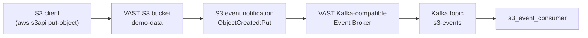

# s3_event_consumer

A small demonstration consumer for **S3 event notifications published by the VAST
Data Kafka-compatible Event Broker**. It subscribes to one Kafka topic, decodes
each message as JSON, and pretty-prints the event payload, so you can watch an
object landing in a VAST S3 bucket turn into a Kafka event in real time.

Nothing here is VAST-specific — it uses the ordinary `confluent-kafka` client,
which is the point: the Event Broker speaks the Kafka protocol. It is a demo
utility, not a production Kafka framework.



You need a VAST Kafka Event Broker, a topic, and an S3 bucket with an event
notification pointing at that topic. If you still need to set that up, follow
**[Deploying a Kafka Event Broker in VAST 5.4](docs/vast-kafka-event-broker-5.4.md)**.

## Option A: standalone executable (no Python needed)

The easiest way to run the demo. Prebuilt executables for **Linux x86_64** and
**macOS Apple Silicon** are checked into [`bin/`](bin/), so you can download one
straight from this repository — no Python, no build step, no CI login.

1. Download the archive for your platform:

   | Platform | Download |
   | --- | --- |
   | Linux x86_64 (glibc 2.28+) | [s3_event_consumer-linux-x86_64.tar.gz](https://github.com/kmacvast/s3_event_consumer/raw/main/bin/s3_event_consumer-linux-x86_64.tar.gz) |
   | macOS Apple Silicon | [s3_event_consumer-macos-arm64.tar.gz](https://github.com/kmacvast/s3_event_consumer/raw/main/bin/s3_event_consumer-macos-arm64.tar.gz) |

   Or from the command line:

   ```bash
   curl -LO https://github.com/kmacvast/s3_event_consumer/raw/main/bin/s3_event_consumer-linux-x86_64.tar.gz
   ```

   These are the unmodified GitHub Actions build artifacts; SHA-256 checksums and
   full build provenance are in [bin/README.md](bin/README.md). Tagged versions
   will additionally appear on the
   [Releases page](https://github.com/kmacvast/s3_event_consumer/releases).

2. Extract it and create your configuration:

   ```bash
   tar -xzf s3_event_consumer-linux-x86_64.tar.gz
   cp s3_consumer_config.example.json s3_consumer_config.json
   ```

3. Edit `s3_consumer_config.json` — see [Configuration](#configuration).
4. Run it:

   ```bash
   ./s3_event_consumer --config s3_consumer_config.json
   ```

**Linux:** requires glibc 2.28 or newer — RHEL/Rocky/AlmaLinux 8 and 9,
Ubuntu 20.04+, Debian 11+. x86_64 only; musl-based distributions such as Alpine
are not supported.

**macOS:** the executable is not code-signed or notarised. Extracting the archive
with `tar` in Terminal leaves it unquarantined and it runs normally. If macOS
does block it, remove the quarantine flag **before** running it — once a
quarantined binary has been blocked, clearing the flag afterwards will not help
and you need to re-extract:

```bash
xattr -d com.apple.quarantine ./s3_event_consumer
```

## Option B: run from Python source

For developers, or anyone who wants to read or modify the script.

```bash
git clone https://github.com/kmacvast/s3_event_consumer.git
cd s3_event_consumer
python3 -m venv .venv
source .venv/bin/activate
pip install -r requirements.txt
cp s3_consumer_config.example.json s3_consumer_config.json
# edit s3_consumer_config.json, then:
python3 s3_event_consumer.py
```

Requires Python 3.9 or newer (tested on 3.9, 3.10, 3.11, 3.12 and 3.13).
Dependencies are `confluent-kafka` (the Kafka client) and `pygments` (JSON
syntax highlighting).

## Configuration

Both options read the same external JSON file — nothing is baked into the
executable.

```json
{
  "kafka_config": {
    "bootstrap.servers": "<KAFKA_VIP_1>:<KAFKA_PORT>,<KAFKA_VIP_2>:<KAFKA_PORT>",
    "group.id": "s3-event-demo",
    "auto.offset.reset": "earliest"
  },
  "topic": "<KAFKA_TOPIC>"
}
```

| Key | Meaning |
| --- | --- |
| `bootstrap.servers` | Comma-separated `host:port` list of Event Broker endpoints. Take the addresses **and the port** from your VAST Event Broker configuration or the VAST documentation for your release — this project makes no assumption about which port your cluster uses. |
| `group.id` | Consumer group name. Kafka tracks read position per group. |
| `auto.offset.reset` | `earliest` replays retained events for a brand-new group; `latest` shows only events published after startup. |
| `topic` | The Kafka topic to consume, exactly as named in VAST. |

Everything under `kafka_config` is passed straight through to librdkafka, so add
`security.protocol`, `sasl.*` or `ssl.*` here if your broker requires
authentication or TLS.

> **Warning**
> `s3_consumer_config.json` is git-ignored on purpose: it names cluster VIPs and
> may contain SASL credentials. Never commit it, and never put access keys in
> this repository.

## Running it

```
--config PATH   path to the JSON configuration file (default: s3_consumer_config.json)
--no-color      disable colourised output (NO_COLOR is also honoured)
```

Startup — operational messages go to **stderr**:

```
2026-01-01 09:00:00 INFO    Configuration:      s3_consumer_config.json
2026-01-01 09:00:00 INFO    Bootstrap servers:  vip-1:<KAFKA_PORT>,vip-2:<KAFKA_PORT>
2026-01-01 09:00:00 INFO    Consumer group:     s3-event-demo
2026-01-01 09:00:00 INFO    Topic:              s3-events
2026-01-01 09:00:00 INFO    Subscribed to 's3-events'. Waiting for events (Ctrl-C to stop).
```

Then nothing, until an object is written. **Silence is the healthy idle state.**
If the broker cannot be reached you get one `No Kafka broker reachable` error
rather than a repeating stream.

When you `PUT` an object into the watched bucket, the payload is printed to
**stdout**:

```
2026-01-01 09:03:41 INFO    Event received (s3-events[0]@0, 742 bytes)
{
  "Records": [
    {
      "eventName": "ObjectCreated:Put",
      "s3": {
        "bucket": { "name": "demo-data" },
        "object": { "key": "hello.txt" }
      }
    }
  ]
}
```

The exact payload schema comes from VAST and may vary by release. Because
payloads go to stdout and logs to stderr, `./s3_event_consumer > events.log`
captures only the events, without colour escapes.

Press **Ctrl-C** to stop; the consumer closes the Kafka consumer cleanly and
exits with status 0.

## Building the executable yourself

One PyInstaller command — no spec file, no hooks. `librdkafka` is picked up
automatically as a binary dependency of `confluent_kafka`.

```bash
python3 -m pip install -r requirements.txt pyinstaller
python3 -m PyInstaller --onefile --name s3_event_consumer --clean s3_event_consumer.py
```

The executable appears in `dist/`. It runs on the OS and CPU architecture you
built it on — there is no cross-compilation.
[.github/workflows/build-release.yml](.github/workflows/build-release.yml)
does the same on native Linux and macOS runners.

## Tests

```bash
python3 -m unittest discover -s tests -v
```

Covers configuration parsing/validation and the message-display path, including
malformed payloads. No live broker required.

## License

[MIT](LICENSE)
