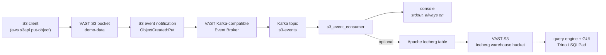

# s3_event_consumer

A small demonstration consumer for **S3 event notifications published by the VAST
Data Kafka-compatible Event Broker**. It subscribes to one Kafka topic, decodes
each message as JSON, and pretty-prints the event payload, so you can watch an
object landing in a VAST S3 bucket turn into a Kafka event in real time.

Nothing here is VAST-specific — it uses the ordinary `confluent-kafka` client,
which is the point: the Event Broker speaks the Kafka protocol. It is a demo
utility, not a production Kafka framework.

It can **optionally** also write each event into an [Apache
Iceberg](#what-is-apache-iceberg) table stored on S3-compatible object storage,
so the event stream becomes something you can run SQL against. That is off by
default: with no `iceberg` section in the configuration file, this behaves
exactly as it always has. See **[Writing events to Apache
Iceberg](#writing-events-to-apache-iceberg)**, or the full walkthrough in
**[docs/iceberg-demo.md](docs/iceberg-demo.md)**.

## Download and run

A single self-contained executable. **No Python, no archive to extract, no
install.**

### 1. Download the executable for your platform

| Platform | Download |
| --- | --- |
| **Linux x86_64** | **[s3_event_consumer](https://raw.githubusercontent.com/kmacvast/s3_event_consumer/main/bin/linux-x86_64/s3_event_consumer)** |
| **macOS ARM64 / Apple Silicon** | **[s3_event_consumer](https://raw.githubusercontent.com/kmacvast/s3_event_consumer/main/bin/macos-arm64/s3_event_consumer)** |

Or from a terminal:

```bash
# Linux x86_64
curl -LO https://raw.githubusercontent.com/kmacvast/s3_event_consumer/main/bin/linux-x86_64/s3_event_consumer

# macOS Apple Silicon
curl -LO https://raw.githubusercontent.com/kmacvast/s3_event_consumer/main/bin/macos-arm64/s3_event_consumer
```

Use these links rather than browsing to the files on GitHub: the web viewer
cannot display a 14 MB binary and reports *"we can't show files that are this
big right now"*. SHA-256 checksums and build provenance are in
[bin/README.md](bin/README.md).

### 2. Create your configuration

```bash
cp s3_consumer_config.example.json s3_consumer_config.json
```

Edit `s3_consumer_config.json` and set the broker endpoints and topic — see
[Configuration](#configuration). If you did not clone the repository, copy
[s3_consumer_config.example.json](s3_consumer_config.example.json) and save it as
`s3_consumer_config.json` next to the executable.

### 3. Run it

```bash
chmod +x s3_event_consumer
./s3_event_consumer --config s3_consumer_config.json
```

`chmod +x` is only needed if the download did not preserve the executable
permission — browsers and some filesystems drop it. If the file already runs, skip it.

**Linux:** requires glibc 2.28 or newer — RHEL/Rocky/AlmaLinux 8 and 9,
Ubuntu 20.04+, Debian 11+. x86_64 only; musl-based distributions such as Alpine
are not supported.

**macOS:** the executable is ad-hoc signed, not notarised, so Gatekeeper blocks
files downloaded by a browser. Downloading with `curl` avoids this. If macOS does
block it, clear the quarantine flag on that file **before** running it — once a
quarantined binary has been blocked, clearing the flag afterwards will not help
and you need to download it again:

```bash
xattr -d com.apple.quarantine ./s3_event_consumer
```

## How it fits together



Solid path is the default behaviour. The dashed path is the optional Iceberg
sink — see [Writing events to Apache Iceberg](#writing-events-to-apache-iceberg).

You need a VAST Kafka Event Broker, a topic, and an S3 bucket with an event
notification pointing at that topic. If you still need to set that up, follow
**[Deploying a Kafka Event Broker in VAST 5.4](docs/vast-kafka-event-broker-5.4.md)**.

## Running from Python source instead

For developers, or anyone who wants to read or modify the script.

```bash
git clone https://github.com/kmacvast/s3_event_consumer.git
cd s3_event_consumer
python3 -m venv .venv
source .venv/bin/activate
pip install -r requirements.txt
cp s3_consumer_config.example.json s3_consumer_config.json
# edit s3_consumer_config.json, then:
python3 s3_event_consumer.py
```

Requires Python 3.9 or newer (tested on 3.9, 3.10, 3.11, 3.12 and 3.13).
Dependencies are `confluent-kafka` (the Kafka client) and `pygments` (JSON
syntax highlighting).

`confluent-kafka` is pinned to `>=2.4,<2.9` deliberately. VAST documents support
for the **Confluent Kafka Python client 2.4 – 2.8** against the Kafka-compatible
Event Broker, and states that `aiokafka` is not supported
([docs](https://kb.vastdata.com/documentation/docs/kafka-protocol-support.md)).
Newer clients may well work, but a customer demo is the wrong place to find out;
widen the pin only after testing against your own cluster.

For the optional Iceberg sink, add:

```bash
pip install -r requirements-iceberg.txt
```

That is a much heavier install — PyArrow and friends, roughly 250 MB — which is
why it is kept separate and why the prebuilt executables do not include it. See
[Packaging and the standalone executables](#packaging-and-the-standalone-executables).

## Configuration

Both the executable and the Python source read the same external JSON file — nothing is baked into the
executable.

```json
{
  "kafka_config": {
    "bootstrap.servers": "<KAFKA_VIP_1>:<KAFKA_PORT>,<KAFKA_VIP_2>:<KAFKA_PORT>",
    "group.id": "s3-event-demo",
    "auto.offset.reset": "earliest"
  },
  "topic": "<KAFKA_TOPIC>"
}
```

| Key | Meaning |
| --- | --- |
| `bootstrap.servers` | Comma-separated `host:port` list of Event Broker endpoints. Take the addresses **and the port** from your VAST Event Broker configuration or the VAST documentation for your release — this project makes no assumption about which port your cluster uses. |
| `group.id` | Consumer group name. Kafka tracks read position per group. |
| `auto.offset.reset` | `earliest` replays retained events for a brand-new group; `latest` shows only events published after startup. |
| `topic` | The Kafka topic to consume, exactly as named in VAST. |

Everything under `kafka_config` is passed straight through to librdkafka, so add
`security.protocol`, `sasl.*` or `ssl.*` here if your broker requires
authentication or TLS.

An optional third key, `iceberg`, enables the Iceberg sink — see [Writing events
to Apache Iceberg](#writing-events-to-apache-iceberg). Leave it out for the
behaviour shown above.

> **Warning**
> `s3_consumer_config.json` is git-ignored on purpose: it names cluster VIPs and
> may contain SASL credentials. Never commit it, and never put access keys in
> this repository.

## Running it

```
--config PATH   path to the JSON configuration file (default: s3_consumer_config.json)
--no-color      disable colourised output (NO_COLOR is also honoured)
--no-iceberg    ignore the 'iceberg' section and run console-only
--check         validate the config, open every sink, then exit without consuming
```

Startup — operational messages go to **stderr**:

```
2026-01-01 09:00:00 INFO    Configuration:      s3_consumer_config.json
2026-01-01 09:00:00 INFO    Bootstrap servers:  vip-1:<KAFKA_PORT>,vip-2:<KAFKA_PORT>
2026-01-01 09:00:00 INFO    Consumer group:     s3-event-demo
2026-01-01 09:00:00 INFO    Topic:              s3-events
2026-01-01 09:00:00 INFO    Subscribed to 's3-events'. Waiting for events (Ctrl-C to stop).
```

Then nothing, until an object is written. **Silence is the healthy idle state.**
If the broker cannot be reached you get one `No Kafka broker reachable` error
rather than a repeating stream.

When you `PUT` an object into the watched bucket, the payload is printed to
**stdout**:

```
2026-01-01 09:03:41 INFO    Event received (s3-events[0]@0, 742 bytes)
{
  "Records": [
    {
      "eventSource": "vast:s3",
      "eventName": "s3:ObjectCreated:Put",
      "s3": {
        "bucket": { "name": "demo-data" },
        "object": { "key": "hello.txt" }
      }
    }
  ]
}
```

VAST prefixes `eventName` with `s3:` and reports `eventSource` as `vast:s3`
([docs](https://kb.vastdata.com/documentation/docs/s3-event-record-format.md)).
The exact payload schema comes from VAST and may vary by release, so nothing
here assumes any field is present.

Saving a bucket notification also makes VAST publish a one-off connectivity test
event — `{"Service": "Vast S3", "Event": "s3:TestEvent", ...}`, without a
`Records` envelope. That is recognised and mapped onto the same fields rather
than being treated as an unparseable payload.

Because payloads go to stdout and logs to stderr,
`./s3_event_consumer > events.log` captures only the events, without colour
escapes.

Press **Ctrl-C** to stop; the consumer closes the Kafka consumer cleanly and
exits with status 0.

## Writing events to Apache Iceberg

Optional, and **off unless you configure it**. With no `iceberg` section — or
with `"enabled": false` — the consumer behaves exactly as it did before this
existed.

### What is Apache Iceberg?

Apache Iceberg is an open table format: it makes a directory of Parquet files on
object storage behave like a real database table. A **catalog** tracks which
metadata file is the current version of each table; that metadata lists which
data files belong to the table, so a reader never has to list a bucket to find
out. Because each write produces a new immutable **snapshot** rather than
mutating anything in place, you get atomic commits, schema evolution, hidden
partitioning, and time travel — querying the table exactly as it was at an
earlier point. Many engines (Trino, Spark, DuckDB, Flink, PyIceberg) read and
write the same table, so the data is not locked to any one of them.

Here, that means the stream of S3 events becomes a table you can run SQL
against, with its Parquet data files and Iceberg metadata stored in a VAST S3
bucket.

### How it works

```
VAST S3 PUT -> S3 event notification -> VAST Event Broker (Kafka topic)
  -> s3_event_consumer -> decode JSON -> console sink   (always on, unchanged)
                                      -> Iceberg sink   (buffered, optional)
```

The Iceberg sink writes Parquet data files into a **VAST S3 warehouse bucket**
and registers each commit with an **Iceberg REST catalog**. Trino and SQLPad
read the same catalog and the same bucket, and are never a dependency of the
consumer itself.

Two pieces are not VAST: the REST catalog and the query layer. VAST publishes no
Iceberg-specific documentation and provides no Iceberg catalog of its own, so an
external REST catalog is the expected approach — VAST supplies the S3 storage,
and the catalog is a separate service you run alongside it. The catalog and
query containers are in `docker/docker-compose.yml`.

The warehouse bucket must be a **different bucket** from the one carrying the
event notification. Writing the warehouse into the watched bucket would make the
demo generate events about its own writes, without end.

Each event is flattened into one row per S3 record and buffered. The buffer is
written as a single Iceberg append — one snapshot — when either `batch_size`
records have accumulated or `flush_interval_seconds` has elapsed. One snapshot
per Kafka event would produce thousands of one-row Parquet files and an
unusable snapshot history, so batching is not an optimisation here, it is a
correctness-of-design point. Pending records are flushed on Ctrl-C, so a
graceful shutdown does not leave buffered records unwritten.

The namespace and table are created automatically on first run, with an
explicit schema — never inferred from whatever payload happened to arrive first.
Parsing is defensive throughout: no field of an S3 event is assumed present, and
the original payload is kept verbatim in a `raw_event` column.

### Delivery semantics

**Iceberg is committed before Kafka.** When the Iceberg sink is on, librdkafka's
automatic offset commits are turned off and offsets are committed by hand, only
after the corresponding records have been appended to the table. Nothing is ever
acknowledged to Kafka that is not already durable in Iceberg.

That makes this **at-least-once, not exactly-once**:

- **An Iceberg write failure does not advance Kafka offsets.** A failed append
  keeps its records buffered and their offsets uncommitted, and retries with
  exponential backoff. If it ultimately gives up, the consumer exits non-zero
  with those offsets *still* uncommitted, so the records remain on the topic and
  are reprocessed on the next run. A graceful Ctrl-C flushes to Iceberg first
  and only then commits; if that final flush fails, the consumer exits non-zero
  and commits nothing. Under the tested single-consumer architecture, the
  outage/recovery tests demonstrate successful replay without data loss —
  see [Validation status](#validation-status) for what that does and does not
  cover.
- **Duplicates are possible.** If the process dies between a successful Iceberg
  commit and its offset commit, those records are replayed and appended again.
  There is **no deduplication yet**, so a replay can produce duplicate rows.
  `kafka_topic`, `kafka_partition` and `kafka_offset` are on every row, so
  duplicates are identifiable after the fact:

  ```sql
  SELECT kafka_topic, kafka_partition, kafka_offset, record_index, count(*)
  FROM iceberg.s3_events.object_events
  GROUP BY 1, 2, 3, 4 HAVING count(*) > 1;
  ```

The retry is bounded in two ways, so a catalog outage never becomes a hot loop
or an unbounded memory leak: `max_flush_attempts` consecutive failures, and
`max_buffered_records` accumulated. Hitting either stops the consumer non-zero
rather than dropping anything.

If the catalog is unreachable *at startup*, the consumer stops immediately with
a clear error — you asked for Iceberg, so silently consuming into nothing would
be worse. A write failure *during* a run is survivable, as above, and the
console output keeps working throughout.

With the Iceberg sink off, none of this applies: offset handling is librdkafka's
default, exactly as it always was.

### Running without Iceberg

The default. Either leave the section out entirely:

```json
{
  "kafka_config": { "bootstrap.servers": "<KAFKA_VIP>:<KAFKA_PORT>", "group.id": "demo" },
  "topic": "s3-events"
}
```

...or keep it and turn it off with `"enabled": false`, or override it per-run:

```bash
python3 s3_event_consumer.py --no-iceberg
```

A disabled section is not validated, so a half-finished one will not block
startup, and PyIceberg is never imported.

### Running the Iceberg demo against VAST

The object store and the event broker are VAST — they are not containers.
`docker/docker-compose.yml` supplies only the Iceberg REST catalog, Trino and
SQLPad, and every VAST-specific value reaches them from the environment, so
nothing is hardcoded and no credential is stored in the repository.

```bash
cp docker/demo.env.example docker/demo.env
# edit docker/demo.env with your VAST endpoints, buckets, topic and keys
set -a; . ./docker/demo.env; set +a
```

`docker/demo.env` is git-ignored and is the single source of truth for the
containers, the consumer and the scripts alike. Then:

```bash
cp s3_consumer_config.vast-demo.example.json s3_consumer_config.json
docker compose -f docker/docker-compose.yml up -d --wait
pip install -r requirements.txt -r requirements-iceberg.txt
./scripts/demo_preflight.sh
python3 s3_event_consumer.py --config s3_consumer_config.json
```

`s3_consumer_config.vast-demo.example.json` is committed and ready to copy:
every value in it is an `env:NAME` reference, so the file itself contains no
endpoint, no bucket name and no credential.

Then write an object into the watched bucket and let VAST publish the event:

```bash
aws s3api put-object \
  --endpoint-url "$VAST_S3_ENDPOINT" \
  --bucket "$VAST_SOURCE_BUCKET" \
  --key demo/readings.csv \
  --body ./readings.csv
```

For a larger burst without writing hundreds of objects, synthetic VAST-shaped
events can be published straight onto the topic:

```bash
python3 scripts/publish_test_events.py \
  --bootstrap-servers "$VAST_KAFKA_BROKER" \
  --topic "$VAST_KAFKA_TOPIC" \
  --count 40
```

You also need the VAST side prepared: an Event Broker, a topic (VAST does not
support automatic topic creation, so create it explicitly), and an S3 bucket
notification on the source view pointing at that topic. The full walkthrough —
VAST preparation, configuration, the demo itself and troubleshooting by layer —
is **[docs/iceberg-demo.md](docs/iceberg-demo.md)**.

To run and verify the whole thing unattended:

```bash
./scripts/smoke_test.sh
```

### Example Iceberg configuration

Everything under `catalog` is passed straight through to PyIceberg, exactly as
everything under `kafka_config` is passed to librdkafka.

This is `s3_consumer_config.vast-demo.example.json` as shipped — every value is
an `env:NAME` reference resolved from the environment at startup, so no
endpoint, bucket or credential is written to the file at all:

```json
{
  "kafka_config": {
    "bootstrap.servers": "env:VAST_KAFKA_BROKER",
    "group.id": "env:VAST_KAFKA_GROUP",
    "auto.offset.reset": "earliest"
  },
  "topic": "env:VAST_KAFKA_TOPIC",

  "iceberg": {
    "enabled": true,
    "namespace": "env:ICEBERG_NAMESPACE",
    "table": "env:ICEBERG_TABLE",
    "batch_size": 25,
    "flush_interval_seconds": 5,
    "create_if_missing": true,
    "max_flush_attempts": 5,
    "retry_backoff_seconds": 5,
    "catalog": {
      "type": "rest",
      "uri": "env:ICEBERG_CATALOG_URI_HOST",
      "warehouse": "env:ICEBERG_WAREHOUSE",
      "s3.endpoint": "env:VAST_S3_ENDPOINT",
      "s3.access-key-id": "env:VAST_S3_ACCESS_KEY",
      "s3.secret-access-key": "env:VAST_S3_SECRET_KEY",
      "s3.region": "env:VAST_S3_REGION",
      "s3.force-virtual-addressing": false
    }
  }
}
```

Literal values work everywhere too — `env:` is optional per value, not a
required style. `s3_consumer_config.example.json` shows the same section with
placeholders instead.

| Key | Default | Meaning |
| --- | --- | --- |
| `enabled` | `true` when the section exists | Set `false` to keep the section but turn the sink off. |
| `namespace` / `table` | `s3_events` / `object_events` | Where rows are written. Created if missing. |
| `batch_size` | `100` | Write after this many buffered records. |
| `flush_interval_seconds` | `10` | Write after this long, even if the batch is not full. |
| `create_if_missing` | `true` | Set `false` to require the table to exist already. |
| `max_flush_attempts` | `5` | Consecutive failed appends before the consumer gives up and exits non-zero. |
| `retry_backoff_seconds` | `5` | First retry delay; doubles per failure, capped at 60s. |
| `max_buffered_records` | `10 × batch_size` | Ceiling on unwritten records before the consumer stops rather than accumulating without bound. |
| `catalog.type` | — | `rest` is what this project is designed and tested for. |
| `catalog.uri` | — | The Iceberg REST catalog endpoint. |
| `catalog.warehouse` | — | Where table data lives, e.g. `s3://bucket/prefix/`. Must not be the bucket carrying the event notification. |
| `catalog.s3.*` | — | Endpoint, credentials, region and addressing for the warehouse. |

**`s3.force-virtual-addressing` is `false` on purpose.** VAST S3 addresses
buckets by path, not by DNS subdomain: virtual-hosted style would resolve
`bucket.s3.your-vast.example`, cannot be used at all against an IP-address
endpoint, and needs wildcard TLS certificates where it can be used
([docs](https://kb.vastdata.com/docs/path-and-virtual-hosted-style-s3-urls)).
There is **no** `s3.path-style-access` property in PyIceberg — a config carrying
that key is silently ignored, which is the worst kind of wrong. Trino spells the
same behaviour `s3.path-style-access=true`, which is correct in Trino's own
configuration; they are different products with different property names.

`s3.region` must be set even though VAST does not route on it, because SigV4
signing requires a region string. VAST's own examples use `us-east-1`
([docs](https://kb.vastdata.com/documentation/docs/connecting-to-the-boto3-client-interface-3)).

> **Warning**
> Any string value written as **`env:NAME`** is read from that environment
> variable at startup, so real access keys never need to be written to a file.
> This works for `kafka_config` values, `topic`, `iceberg.namespace`,
> `iceberg.table`, `iceberg.catalog_name` and every property under
> `iceberg.catalog`. Credentials are redacted from every log line the consumer
> writes, including any embedded in a catalog URI. Your own
> `s3_consumer_config.json` stays git-ignored — never commit one with real keys.

### Querying the table

In the **GUI** at <http://localhost:3000> (no login; the `VAST S3 - Apache
Iceberg` connection is pre-selected), or through the Trino CLI:

```bash
docker compose -f docker/docker-compose.yml exec trino trino
```

**Row count:**

```sql
SELECT count(*) FROM iceberg.s3_events.object_events;
```

**Latest events:**

```sql
SELECT ingest_time, event_name, bucket, object_key, object_size
FROM iceberg.s3_events.object_events
ORDER BY ingest_time DESC, kafka_offset DESC
LIMIT 20;
```

**Snapshots** — one per commit, so this also shows the batching:

```sql
SELECT snapshot_id, committed_at, operation, summary['added-records'] AS added
FROM iceberg.s3_events."object_events$snapshots"
ORDER BY committed_at;
```

```
     snapshot_id     |        committed_at         | operation | added
---------------------+-----------------------------+-----------+-------
 4969459501675822066 | 2026-08-31 17:29:19.203 UTC | append    | 25
 1756592349298766766 | 2026-08-31 17:29:24.375 UTC | append    | 15
```

**Time travel** — the table as it was at an earlier snapshot:

```sql
SELECT count(*) FROM iceberg.s3_events.object_events
FOR VERSION AS OF 4969459501675822066;
```

Or by wall-clock time:

```sql
SELECT count(*) FROM iceberg.s3_events.object_events
FOR TIMESTAMP AS OF TIMESTAMP '2026-08-31 17:29:20 UTC';
```

**The data files**, showing Iceberg's hidden partitioning:

```sql
SELECT file_path, record_count FROM iceberg.s3_events."object_events$files";
```

### What you have to supply

Nothing in the application is VAST-specific — it is configuration all the way
down. What the demo needs from outside itself:

| Piece | Where it comes from | Notes |
| --- | --- | --- |
| Event Broker VIPs **and port** | Your VAST Event Broker configuration | The listener port is not documented publicly; take it from your own cluster rather than assuming one. |
| Kafka topic | Created by hand in VAST | Automatic topic creation is not supported. Default retention 7 days; partition count fixed at creation. |
| S3 bucket notification | Element Store → Views → Bucket Notifications, or `eventnotification create` | Saving one makes VAST publish a connectivity test event immediately, which the consumer recognises and records. |
| Source bucket | VAST S3 | The bucket the notification watches. |
| Warehouse bucket | VAST S3 | Must be a **different** bucket from the source. |
| S3 access keys | Generated per user through VMS | The only way to create them. |
| Iceberg REST catalog | You run it | VAST publishes no Iceberg documentation and provides no catalog; `docker/docker-compose.yml` runs `apache/iceberg-rest-fixture` for the demo. It is a test fixture, not a production catalog. |

`batch_size` 25 and `flush_interval_seconds` 5 in the demo config are chosen so
a commit is visible within seconds. Raise both for anything else — every commit
is a snapshot.

Run `./scripts/demo_preflight.sh` before the first real run: twenty-three checks
across the environment, VAST S3, the Event Broker, the containers and the
Iceberg table, with credentials masked in the output. Or run the consumer with
`--check`, which creates the namespace and table and exits, proving the whole
write path before a single event is consumed.

## Validation status

Everything in this repository has been exercised end to end against a **local
stand-in stack**, using the exact compose file that ships here and driven
entirely by the same environment variables a real cluster would populate. **None
of it has been run against a real VAST cluster yet.** Read any claim about
behaviour with that distinction in mind.

**STAND-IN VALIDATION — COMPLETE.** 219 unit tests pass; `ruff` clean;
`shellcheck` clean. Full smoke test: 40 events published, 40 rows written, 2
snapshots, with Parquet files, manifests and an `ingest_time_day=` partition
directory present in the warehouse. Outage/recovery test: catalog stopped
mid-run — consumer exits 1, no Kafka offsets committed, no rows written; catalog
restored — all 30 events replayed and ingested, offset advanced to 30. Preflight
23 of 23. Reset verified, including its guard rails. PyInstaller build.

**VAST LAB VALIDATION — PENDING.** Not performed, and not simulated anywhere in
this repository: a real VAST Kafka-compatible Event Broker including its
listener port, real VAST-generated S3 event payloads, the connectivity test
event as actually published, VAST S3 as the Iceberg warehouse, VAST S3 endpoint
and TLS/authentication behaviour, the REST catalog writing metadata into VAST
S3, REST catalog connectivity from the work lab, the end-to-end VAST S3 PUT →
Event Broker → consumer → Iceberg → query path, multi-event/batch behaviour on
the real Event Broker, failure/recovery behaviour in the VAST environment, and
`confluent-kafka` 2.4–2.8 against the real broker.

Also untested: **Kafka rebalance behaviour** — every test runs a single consumer
against a single-partition topic, and VAST does not support cooperative
rebalancing, so any rebalance is eager.

Full breakdown in
[docs/iceberg-demo.md](docs/iceberg-demo.md#validation-status).

## Packaging and the standalone executables

**The prebuilt executables in `bin/` do not include Iceberg support**, on
purpose. Running one with `iceberg.enabled: true` exits 1 with a message telling
you to install `requirements-iceberg.txt` and run from source — not a bare
`ModuleNotFoundError`.

Measured on this repository, both platforms building with PyInstaller 6.22.2:

| Build | Linux x86_64 | macOS arm64 | Iceberg |
| --- | --- | --- | --- |
| Default (as shipped) | 15.0 MB | 15.7 MB | no |
| PyIceberg bundled, plain `--onefile` | 94 MB | 76 MB | **reads only — appends fail** |
| PyIceberg bundled, `--collect-all pyiceberg_core` | — | 89 MB | yes |

Bundling PyIceberg works, but **not with a plain `--onefile`**. PyInstaller does
not pick up `pyiceberg_core`, the Rust extension PyIceberg loads at *write*
time, so a naively bundled binary connects to the catalog and reads tables
happily, then fails on every append with `NotInstalledError: pyiceberg_core
needs to be installed`. `--collect-all pyiceberg_core` fixes it, at 89 MB on
macOS arm64.

That failure mode — reads fine, writes never — is exactly the kind of thing that
surfaces at demo time rather than build time, and it is why the shipped
executables stay lightweight. The size is driven by PyArrow (~126 MB installed),
`pyiceberg_core` (~59 MB) and botocore (~26 MB), and it adds two C-extension
bundling paths much more likely to break on a future dependency bump than
`librdkafka` alone.

The trade-off is not worth forcing on everyone who wants the original 15 MB
one-file download, so the split is:

- **Standalone executable** — the lightweight Kafka-and-console tool. Unchanged
  size, unchanged download story, no Python needed.
- **From Python source** — everything, including the Iceberg sink.

If you do want a single executable with Iceberg in it, the build works:

```bash
pip install -r requirements.txt -r requirements-iceberg.txt pyinstaller
pyinstaller --onefile --name s3_event_consumer_iceberg --clean \
  --collect-all pyiceberg_core --collect-submodules pyiceberg \
  s3_event_consumer.py
```

Do not drop `--collect-all pyiceberg_core`: without it the binary builds, starts,
and reads the catalog, but every append fails at runtime.

The default build excludes it explicitly, so building in an environment that
happens to have PyIceberg installed still produces the small executable:

```bash
pip install -r requirements.txt pyinstaller
pyinstaller --onefile --name s3_event_consumer --clean \
  --exclude-module pyiceberg --exclude-module pyarrow \
  s3_event_consumer.py
```

## Building the executable yourself

One PyInstaller command — no spec file, no hooks. `librdkafka` is picked up
automatically as a binary dependency of `confluent_kafka`.

```bash
python3 -m pip install -r requirements.txt pyinstaller
python3 -m PyInstaller --onefile --name s3_event_consumer --clean \
  --exclude-module pyiceberg --exclude-module pyarrow \
  s3_event_consumer.py
```

The two `--exclude-module` flags make the result the same ~15 MB executable
whether or not the build environment happens to have PyIceberg installed. See
[Packaging and the standalone executables](#packaging-and-the-standalone-executables)
for the Iceberg-enabled build.

The executable appears in `dist/`. It runs on the OS and CPU architecture you
built it on — there is no cross-compilation.
[.github/workflows/build-release.yml](.github/workflows/build-release.yml)
does the same on native Linux and macOS runners.

## Tests

```bash
python3 -m unittest discover -s tests -v
```

219 tests covering configuration parsing and validation (with and without the
`iceberg` section), `env:NAME` resolution across every field that supports it,
the message-display path including malformed payloads, event flattening against
incomplete and structurally wrong payloads — including VAST's connectivity test
event — sink dispatch and failure isolation, and the Iceberg sink's batching,
flush-on-shutdown, table creation and write-failure handling.

PyIceberg is mocked throughout, so **no live broker, no Docker, no catalog and
no PyIceberg installation are required** — only `requirements.txt`. Three schema
assertions skip themselves if PyIceberg is not installed.

The tests that need infrastructure are kept separate on purpose. All four read
their VAST endpoints, buckets, topic and credentials from the environment:

```bash
set -a; . ./docker/demo.env; set +a
```

**Before a demo**, check every layer:

```bash
./scripts/demo_preflight.sh
```

Twenty-three checks across the environment, the Python environment, the consumer
configuration, VAST S3 reachability and authentication, the Event Broker, the
containers, the catalog/Trino/SQLPad, and the Iceberg table. It never prints a
credential — secrets are masked, endpoints and bucket names are not, because you
need to see what you are pointed at. Read-only apart from one clearly marked
check that creates the namespace and table; skip that with `--no-table-init`.

**After a demo, or between runs**, get back to a clean baseline:

```bash
./scripts/demo_reset.sh              # dry run: prints what it would do, changes nothing
./scripts/demo_reset.sh --confirm    # apply
```

It drops and recreates the demo table and clears the demo consumer group's
offsets so the topic replays. `--purge-source` additionally removes the demo
objects from the watched bucket, under the demo key prefix only. It changes
nothing without `--confirm`, never deletes a bucket, only ever touches the one
namespace and table named in the environment, and refuses obviously dangerous
names such as `default`, `system` or `*`.

**End to end:**

```bash
./scripts/smoke_test.sh
```

It brings up the containers, publishes synthetic events onto the configured
topic, runs the consumer, and asserts the row count grew by exactly the number
published, that snapshots were created, that batching batched, that the Parquet
and Iceberg metadata files exist in the warehouse bucket, and that
`--no-iceberg` still runs console-only. Those are **test rows** in a real table,
so follow it with `./scripts/demo_reset.sh --confirm`.

```bash
./scripts/outage_test.sh
```

That one proves the delivery semantics: it stops the Iceberg REST catalog
mid-run, publishes events into the outage, and asserts the consumer retries
within its bounds, exits non-zero, commits **no** Kafka offsets and writes no
rows — then restores the catalog and asserts every event is subsequently
ingested. Both require Docker, a reachable broker and
`requirements-iceberg.txt`, and both exercise the single-consumer architecture
only — they have not yet been run against a real VAST cluster; see
[Validation status](#validation-status).

## License

[MIT](LICENSE)
