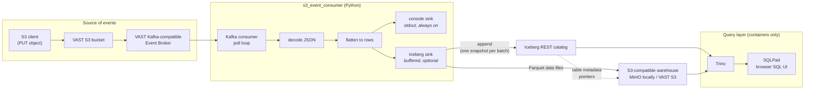

# S3 events into Apache Iceberg — local demo

A self-contained walkthrough for running `s3_event_consumer` with its Iceberg
sink enabled, against a local stack on a laptop. No VAST cluster is required to
follow it; the last section explains what changes when you point it at one.

- [What this demonstrates](#what-this-demonstrates)
- [Architecture](#architecture)
- [Components](#components)
- [Startup sequence](#startup-sequence)
- [Demo script](#demo-script)
- [The table](#the-table)
- [Delivery semantics](#delivery-semantics)
- [Validation status](#validation-status)
- [Troubleshooting](#troubleshooting)
- [Swapping MinIO for VAST S3](#swapping-minio-for-vast-s3)
- [What is implemented, and what is not](#what-is-implemented-and-what-is-not)

## What this demonstrates

An object landing in an S3 bucket becomes a Kafka event, and that event becomes
a queryable row in an Apache Iceberg table whose data files live on
S3-compatible object storage. You watch the row count climb while the consumer
runs, then query the table from SQL and from a browser UI, and use
Iceberg-native features — snapshots and time travel — on the result.

**Currently this stores the S3 event *metadata*.** It does not fetch and parse
the referenced object's contents; see [What is implemented, and what is
not](#what-is-implemented-and-what-is-not).

## Architecture



The consumer writes to Iceberg. Trino only reads. Trino is **never** a
dependency of the Python application — it is a container in this demo
environment, nothing more.

## Components

| Container | Image | Port | Role |
| --- | --- | --- | --- |
| `minio` | `minio/minio` | 9000 (API), 9001 (console) | S3-compatible object store. This is the Iceberg **warehouse** — where Parquet data files and Iceberg metadata actually live. Stands in for VAST S3. |
| `demo-init` | `minio/mc` | — | One-shot. Creates the `warehouse` bucket and makes the catalog volume writable, then exits. |
| `iceberg-rest` | `apache/iceberg-rest-fixture` | 8181 | Iceberg **REST catalog**. Tracks which metadata file is the current version of each table. Backed by SQLite on a named volume. |
| `trino` | `trinodb/trino` | 8080 | SQL query engine. Reads the same catalog and warehouse the consumer writes to. |
| `sqlpad` | `sqlpad/sqlpad` | 3000 | Browser SQL UI, pre-wired to Trino. The GUI. |
| `kafka` | `apache/kafka` | 19092 | Single-node KRaft broker, standing in for the VAST Event Broker so the demo runs on a laptop. |

Everything binds to `127.0.0.1` only.

### Why these choices

**PyIceberg, not Spark.** Spark is the usual Iceberg writer, but it is a JVM
cluster dependency for what is a single-process demo consumer. PyIceberg writes
Iceberg tables directly from Python with no JVM at all. Spark is not a
dependency of this project and is not needed to run any part of this demo.

**A REST catalog, not Hive or a filesystem catalog.** The REST catalog is the
portable option: the same consumer configuration works against this local
fixture, against a managed catalog, or eventually against a VAST-hosted one,
because the client only ever speaks the Iceberg REST protocol.

**Trino for queries, and SQLPad for the GUI.** Trino's own web UI at
`http://localhost:8080/ui/` is a cluster and query *monitoring* dashboard — it
has no SQL editor. SQLPad supplies the editor, bundles a native Trino driver so
nothing is downloaded at first use, and is pre-seeded through environment
variables with authentication switched off, so opening it puts you straight into
a query editor against the right catalog.

## Startup sequence

Order matters, and the compose file enforces it with health checks and
`depends_on` conditions, so `docker compose up` is enough:

1. **`minio`** starts and reports healthy.
2. **`demo-init`** creates the `warehouse` bucket, chowns the catalog volume, exits 0.
3. **`iceberg-rest`** starts — it needs the bucket to exist — and reports healthy.
4. **`trino`** starts once the catalog is healthy, and loads the `iceberg` catalog.
5. **`sqlpad`** starts once Trino is healthy.
6. **`kafka`** starts independently of all of the above.

Then, separately, **the consumer** creates the namespace and table on first run
if they do not exist.

## Demo script

### 0. Install

```bash
python3 -m venv .venv
source .venv/bin/activate
pip install -r requirements.txt -r requirements-iceberg.txt
```

The Iceberg extra is a large install (PyArrow and friends, roughly 250 MB). See
the packaging note in the [README](../README.md#packaging-and-the-standalone-executables).

### 1. Start the local Iceberg environment

```bash
docker compose -f docker/docker-compose.yml up -d --wait
```

`--wait` blocks until every health check passes. First run pulls several GB of
images.

### 2. Create the table, and show the row count is zero

```bash
python3 s3_event_consumer.py --config s3_consumer_config.local-iceberg.json --check
```

`--check` validates the configuration, connects to the catalog, creates the
namespace and table if they are missing, then exits without consuming. It is the
fastest way to prove the Iceberg half works before involving Kafka.

```bash
docker compose -f docker/docker-compose.yml exec -T trino \
  trino --execute "SELECT count(*) FROM iceberg.s3_events.object_events"
```

```
"0"
```

### 3. Start the consumer

In its own terminal, so you can watch events arrive:

```bash
python3 s3_event_consumer.py --config s3_consumer_config.local-iceberg.json
```

```
2026-08-31 12:29:14 INFO    Configuration:      s3_consumer_config.local-iceberg.json
2026-08-31 12:29:14 INFO    Bootstrap servers:  localhost:19092
2026-08-31 12:29:14 INFO    Consumer group:     s3-event-iceberg-demo
2026-08-31 12:29:14 INFO    Topic:              s3-events
2026-08-31 12:29:14 INFO    Iceberg table:      s3_events.object_events
2026-08-31 12:29:14 INFO    Iceberg catalog:    http://localhost:8181
2026-08-31 12:29:14 INFO    Iceberg batching:   up to 25 record(s) or 5.0s, whichever comes first
2026-08-31 12:29:15 INFO    Using existing Iceberg table s3_events.object_events at s3://warehouse/s3_events/object_events
2026-08-31 12:29:15 INFO    Subscribed to 's3-events'. Waiting for events (Ctrl-C to stop).
```

### 4. Generate S3 events

In a third terminal:

```bash
python3 scripts/publish_test_events.py --count 40
```

Against a real VAST cluster this step is replaced by writing objects to the
watched bucket — `aws s3api put-object ...` — and letting VAST publish the
events itself.

By default one message in five uses a deliberately awkward payload shape —
missing `size`, missing `eTag`, an unparseable `eventTime`, two records in one
message, a URL-encoded key, an empty `Records` list, or a payload that is not an
S3 event at all. That is the point: the flattening code has to cope. Pass
`--well-formed-only` for a tidier demo.

The consumer's terminal prints each event payload, and reports each commit:

```
2026-08-31 12:29:19 INFO    Committed 25 record(s) to s3_events.object_events (batch size reached); 25 record(s) total in this session.
2026-08-31 12:29:24 INFO    Committed 15 record(s) to s3_events.object_events (flush interval elapsed); 40 record(s) total in this session.
```

Note **two commits for forty events**. One Iceberg snapshot per Kafka event
would be a poor design — thousands of one-row Parquet files and an unreadable
snapshot history — so records buffer until either `batch_size` (25 here) or
`flush_interval_seconds` (5) is reached.

### 5. Watch the row count increase

```bash
watch -n 2 'docker compose -f docker/docker-compose.yml exec -T trino \
  trino --execute "SELECT count(*) FROM iceberg.s3_events.object_events"'
```

Publish another batch and watch it climb.

### 6. Query the latest rows in the GUI

Open **<http://localhost:3000>**. No login, and the `Iceberg on MinIO (via
Trino)` connection is already selected with the `s3_events` schema browsable in
the sidebar.

```sql
SELECT ingest_time, event_name, bucket, object_key, object_size
FROM s3_events.object_events
ORDER BY ingest_time DESC, kafka_offset DESC
LIMIT 20;
```

Prefer a terminal? The Trino CLI is inside the container:

```bash
docker compose -f docker/docker-compose.yml exec trino trino
```

```sql
USE iceberg.s3_events;
SELECT count(*) FROM object_events;
```

### 7. Demonstrate Iceberg-native capabilities

**Snapshots.** Every commit is a snapshot, and Iceberg keeps the lineage:

```sql
SELECT snapshot_id, committed_at, operation, summary['added-records'] AS added
FROM iceberg.s3_events."object_events$snapshots"
ORDER BY committed_at;
```

```
     snapshot_id     |        committed_at         | operation | added
---------------------+-----------------------------+-----------+-------
 4969459501675822066 | 2026-08-31 17:29:19.203 UTC | append    | 25
 1756592349298766766 | 2026-08-31 17:29:24.375 UTC | append    | 15
```

**Time travel.** Query the table as it was at an earlier snapshot — the older
data files were never rewritten, so the old view is still exact:

```sql
SELECT count(*) FROM iceberg.s3_events.object_events
FOR VERSION AS OF 4969459501675822066;
```

```
 25
```

...against `SELECT count(*)` on the live table returning `40`. By wall-clock
time instead of snapshot id:

```sql
SELECT count(*) FROM iceberg.s3_events.object_events
FOR TIMESTAMP AS OF TIMESTAMP '2026-08-31 17:29:20 UTC';
```

**Hidden partitioning and file layout.** The table is partitioned by ingestion
day, but no query ever mentions the partition column — Iceberg derives it:

```sql
SELECT file_path, record_count FROM iceberg.s3_events."object_events$files";
```

```
 s3://warehouse/s3_events/object_events/data/ingest_time_day=2026-08-31/00000-0-7de0a03d-....parquet |  25
 s3://warehouse/s3_events/object_events/data/ingest_time_day=2026-08-31/00000-0-c3aab186-....parquet |  15
```

**The files themselves**, in the object store:

```bash
docker compose -f docker/docker-compose.yml exec minio \
  sh -c 'mc alias set l http://localhost:9000 minioadmin minioadmin >/dev/null && mc ls --recursive l/warehouse/'
```

```
s3_events/object_events/data/ingest_time_day=2026-08-31/00000-0-7de0a03d-....parquet   10KiB
s3_events/object_events/data/ingest_time_day=2026-08-31/00000-0-c3aab186-....parquet  9.4KiB
s3_events/object_events/metadata/00000-c66d76fd-....metadata.json                     1.8KiB
s3_events/object_events/metadata/00001-d3d7d798-....metadata.json                     2.6KiB
s3_events/object_events/metadata/00002-d3cc29a2-....metadata.json                     3.4KiB
s3_events/object_events/metadata/7de0a03d-...-m0.avro                                 5.7KiB
s3_events/object_events/metadata/c3aab186-...-m0.avro                                 5.7KiB
s3_events/object_events/metadata/snap-1756592349298766766-0-....avro                  1.8KiB
s3_events/object_events/metadata/snap-4969459501675822066-0-....avro                  1.7KiB
```

That is the whole Iceberg model visible at once: Parquet **data files** under a
hidden partition directory; one **metadata.json** per table version; **manifest**
files (`-m0.avro`) listing data files; and **manifest lists**
(`snap-<id>-...avro`), one per snapshot. Or browse it in the MinIO console at
<http://localhost:9001> (`minioadmin` / `minioadmin`).

### 8. Stop

Ctrl-C the consumer. It flushes whatever is still buffered before exiting, so a
graceful shutdown does not leave buffered records unwritten:

```
2026-08-31 12:41:06 INFO    Interrupted, shutting down.
2026-08-31 12:41:06 INFO    Flushing 10 buffered record(s) before shutdown.
2026-08-31 12:41:06 INFO    Committed 10 record(s) to s3_events.object_events (shutdown); 35 record(s) total in this session.
2026-08-31 12:41:06 INFO    Iceberg sink closed: 35 record(s) written in 2 commit(s), 0 dropped.
2026-08-31 12:41:06 INFO    Closing Kafka consumer.
```

Then tear down. **`-v` deletes the warehouse and the catalog**; omit it to keep
the table for next time:

```bash
docker compose -f docker/docker-compose.yml down -v
```

### Running it all at once

`scripts/smoke_test.sh` performs steps 1–6 unattended and asserts the results —
row count grew by exactly the number of events published, a new snapshot was
created, batching actually batched, the Parquet and metadata files exist, and
`--no-iceberg` still runs console-only:

```bash
./scripts/smoke_test.sh
```

It needs Docker and the Iceberg extra installed. It is deliberately **not** part
of `python3 -m unittest discover -s tests`, which never needs Docker, Kafka,
MinIO or a live catalog.

## The table

`s3_events.object_events`, schema declared explicitly in
[`s3events/sinks/iceberg.py`](../s3events/sinks/iceberg.py):

| Column | Iceberg type | Required | Notes |
| --- | --- | --- | --- |
| `ingest_time` | `timestamptz` | yes | When the consumer received the message. The partition source. |
| `kafka_topic` | `string` | no | |
| `kafka_partition` | `int` | no | |
| `kafka_offset` | `long` | no | |
| `record_index` | `int` | no | Position within the message's `Records` array. |
| `event_name` | `string` | no | For example `ObjectCreated:Put`. |
| `event_time` | `timestamptz` | no | Reported by S3, when the payload carries one. |
| `event_source` | `string` | no | |
| `bucket` | `string` | no | |
| `object_key` | `string` | no | URL-decoded. |
| `object_size` | `long` | no | Bytes, when present. |
| `object_etag` | `string` | no | |
| `raw_event` | `string` | yes | The Kafka message payload verbatim. |

Partitioned by `day(ingest_time)`.

**Why the schema is explicit.** Inferring it from whatever event arrived first
would produce a table whose shape depends on a sample — and VAST payload schemas
vary by release. Everything except `ingest_time` and `raw_event` is optional,
because no field of an S3 event notification is guaranteed to be there.

**Why `raw_event` exists.** Flattening is lossy by construction. Keeping the
original payload as a string means nothing dropped by the flattener is
unrecoverable, and you can always reach fields the schema has no column for:

```sql
SELECT json_extract_scalar(raw_event, '$.Records[0].awsRegion') AS region,
       count(*)
FROM iceberg.s3_events.object_events
GROUP BY 1;
```

**One Kafka message can produce several rows.** An S3 notification carries a
`Records` array; each element becomes a row, sharing the message's Kafka offset,
ingestion timestamp and `raw_event`, distinguished by `record_index`.

## Delivery semantics

The contract, when the Iceberg sink is enabled:

> **Nothing is acknowledged to Kafka that is not already durable in Iceberg.**

Concretely, per batch:

1. Records are buffered, together with the Kafka offset each came from.
2. The batch is appended to Iceberg. This is one commit, one snapshot.
3. **Only if that append succeeded**, the Kafka offsets are committed —
   synchronously, as `last offset + 1` per partition.

`enable.auto.commit` is forced off when the Iceberg sink is on, because
librdkafka's automatic commits advance the read position on a timer with no
relation to whether the records reached the table. With the sink off, offset
handling is untouched and behaves exactly as it always did.

### What happens when Iceberg is unavailable

A failed append **keeps its batch**. The records and their offsets stay
buffered, and the append is retried with exponential backoff
(`retry_backoff_seconds`, doubling, capped at 60s) so an outage never becomes a
hot loop against a dead endpoint. Each attempt is logged.

The retry is bounded two ways:

| Bound | Default | On reaching it |
| --- | --- | --- |
| `max_flush_attempts` | 5 consecutive failures | Consumer stops, exit 1 |
| `max_buffered_records` | 10 × `batch_size` | Consumer stops, exit 1 |

Either way the records are **still buffered and their offsets still
uncommitted**, so stopping is what preserves them: they remain on the Kafka
topic and are reprocessed when the consumer is restarted against a healthy
catalog.

On Ctrl-C, the sink flushes to Iceberg first and commits offsets only if that
succeeded. If the final flush fails, the consumer exits **non-zero** having
committed nothing.

`scripts/outage_test.sh` proves all of this against the real stack — it stops
the REST catalog mid-run, publishes events into the outage, asserts the consumer
exits non-zero with no offsets committed and no rows written, then restores the
catalog and asserts every event is subsequently ingested.

```bash
./scripts/outage_test.sh
```

### At-least-once, and what that costs

This is **at-least-once delivery, not exactly-once.** Under the tested
single-consumer architecture, Iceberg write failures do not advance Kafka
offsets, and the outage/recovery tests demonstrate successful replay without
data loss. There is one window in which records can be **duplicated**: between a
successful Iceberg commit and its Kafka offset commit. If the process is killed
there, the next run replays those records and appends them again.

What that claim covers, and what it does not, is set out in
[Validation status](#validation-status). Kafka rebalance behaviour and the real
VAST lab environment have not yet been validated.

There is **no deduplication**. Anything that replays a topic — a hard kill, a
consumer-group offset reset, deliberately re-reading with
`auto.offset.reset: earliest` under a fresh group — appends the events again.

Every row carries the Kafka coordinates it came from, so duplicates are at least
identifiable:

```sql
SELECT kafka_topic, kafka_partition, kafka_offset, record_index, count(*) AS copies
FROM iceberg.s3_events.object_events
GROUP BY 1, 2, 3, 4
HAVING count(*) > 1
ORDER BY copies DESC;
```

Making that impossible needs idempotency — an Iceberg MERGE keyed on
`(topic, partition, offset, record_index)`, or a dedup pass at query time. That
is future work, not implemented here.

## Validation status

This milestone has been exercised end to end against the **local** Docker
Compose stack. It has **not** yet been run against a real VAST cluster. Both
statements matter when reading any claim in this document.

### LOCAL VALIDATION — COMPLETE

Verified against `docker/docker-compose.yml` by `scripts/smoke_test.sh` and
`scripts/outage_test.sh`, from empty volumes:

- local Kafka (single-node KRaft container)
- Iceberg REST catalog (`apache/iceberg-rest-fixture`)
- S3-compatible local object storage (MinIO)
- PyIceberg writer
- Trino
- SQLPad
- batching
- snapshots
- time travel
- Kafka offset semantics
- catalog outage/recovery
- PyInstaller

### VAST LAB VALIDATION — PENDING

None of the following has been performed. The VAST lab is reachable only from
the maintainer's work environment, and these tests will be run there separately.
Nothing in this repository simulates or stands in for them:

- real VAST Kafka-compatible Event Broker
- real VAST-generated S3 event payloads
- VAST S3 as the Iceberg warehouse
- VAST S3 endpoint/authentication behaviour
- REST catalog connectivity from the work lab
- end-to-end VAST S3 PUT → Event Broker → consumer → Iceberg → query
- multi-event/batch behaviour using the real Event Broker
- failure/recovery behaviour in the VAST environment

### Known gaps in the local validation

Even locally, two things are untested:

- **Kafka rebalance behaviour.** Every test runs a single consumer against a
  single-partition topic. What happens to buffered-but-unwritten records when a
  partition is reassigned mid-batch has not been exercised.
- **The synthetic event payloads** in `scripts/publish_test_events.py` are
  modelled on the AWS-compatible S3 notification shape, not captured from VAST.
  The flattening code is deliberately defensive about this, but the real payload
  schema is a VAST-side detail that only the lab can confirm.

## Troubleshooting

### `Cannot start: PyIceberg is not installed`

The Iceberg extra is not installed, or you are running a prebuilt standalone
executable — which deliberately does not bundle it.

```bash
pip install -r requirements-iceberg.txt
```

### `Could not connect to the Iceberg catalog ... Connection refused`

The REST catalog is not up.

```bash
docker compose -f docker/docker-compose.yml ps
curl -s "http://localhost:8181/v1/config?warehouse=s3://warehouse/"
docker compose -f docker/docker-compose.yml logs iceberg-rest
```

### `iceberg-rest` exits immediately with `SQLITE_CANTOPEN`

The catalog volume is not writable by the container's unprivileged user. This is
what `demo-init` prevents. If you added the volume by hand, or removed
`demo-init`, recreate the stack:

```bash
docker compose -f docker/docker-compose.yml down -v
docker compose -f docker/docker-compose.yml up -d --wait
```

### No Kafka broker reachable

```bash
docker compose -f docker/docker-compose.yml logs kafka
```

The broker advertises `localhost:19092` to the host. If you run the consumer
*inside* a container on the compose network, use `kafka:9092` instead.

### The consumer runs, prints events, but the table stays empty

Look for `Committed ... record(s)` in the consumer's stderr.

- If you see `Iceberg sink: disabled`, the `iceberg` section is missing or
  `enabled` is false — or `--no-iceberg` is on the command line.
- If you see nothing, the batch is still filling. With the demo config, a
  partial batch is written within 5 seconds; the default config waits 10.
- If you see `Iceberg append failed`, the message says why. The consumer keeps
  running by design, so this does not stop the console output.

### The consumer exits 1 saying records could not be written

Iceberg was unavailable and the bounded retry ran out. This is working as
designed: the records are still on the Kafka topic and their offsets were never
committed. Fix the catalog, restart the consumer, and they will be reprocessed.

```bash
docker compose -f docker/docker-compose.yml ps iceberg-rest
docker compose -f docker/docker-compose.yml logs --tail 50 iceberg-rest
```

To ride out longer outages, raise `max_flush_attempts` and
`max_buffered_records` — but memory is the real limit, and stopping is safe.

### Trino says `Failed to load table` or the schema is missing

Trino caches catalog metadata briefly. If the consumer created the table
seconds ago, retry. If the table genuinely does not exist, run the consumer with
`--check` to create it.

### Queries fail with an S3 access error from Trino

`docker/trino/catalog/iceberg.properties` and the consumer's config must point at
the *same* endpoint and credentials. Trino reaches MinIO on the compose network
as `http://minio:9000`; the consumer, running on the host, uses
`http://localhost:9000`. Both are correct — they are different paths to the same
store.

### Row counts differ between the consumer's tally and SQL

The consumer counts *rows written*; one Kafka message can produce several. And
if you replay a topic with the same consumer group after resetting offsets,
events are written twice — the sink appends, it does not deduplicate.

## Swapping MinIO for VAST S3

Nothing in the application changes. The compose stack is a stand-in for
infrastructure, not part of the program.

Edit your own git-ignored `s3_consumer_config.json` (start from
`s3_consumer_config.example.json`, not the `local-iceberg` one):

| Setting | Local demo | VAST |
| --- | --- | --- |
| `kafka_config.bootstrap.servers` | `localhost:19092` | Your Event Broker VIPs and port |
| `iceberg.catalog.uri` | `http://localhost:8181` | Your Iceberg REST catalog endpoint |
| `iceberg.catalog.warehouse` | `s3://warehouse/` | `s3://<your-bucket>/<prefix>/` |
| `iceberg.catalog.s3.endpoint` | `http://localhost:9000` | Your VAST S3 endpoint, normally `https://` |
| `iceberg.catalog.s3.access-key-id` | `minioadmin` | `env:VAST_S3_ACCESS_KEY_ID` |
| `iceberg.catalog.s3.secret-access-key` | `minioadmin` | `env:VAST_S3_SECRET_ACCESS_KEY` |
| `iceberg.catalog.s3.region` | `us-east-1` | Whatever your deployment expects |
| `iceberg.catalog.s3.path-style-access` | `true` | Usually `true` for a non-AWS endpoint |
| `iceberg.batch_size` / `flush_interval_seconds` | `25` / `5` — tuned so a demo commits visibly often | Larger; every commit is a snapshot |

Any catalog value written as `env:NAME` is read from that environment variable at
startup, so real keys never go into a file:

```bash
export VAST_S3_ACCESS_KEY_ID=...
export VAST_S3_SECRET_ACCESS_KEY=...
python3 s3_event_consumer.py --config s3_consumer_config.json --check
```

Credentials are redacted from every log line the consumer writes — but they are
still in your shell history and environment, so treat them accordingly.

**The one genuine prerequisite is an Iceberg REST catalog.** MinIO is trivially
replaceable by VAST S3, since both are S3-compatible and the endpoint is just
configuration. The catalog is not part of S3 — you need a REST catalog service
reachable from wherever the consumer runs. For a lab, the
`apache/iceberg-rest-fixture` container in this compose file can be pointed at a
VAST S3 warehouse instead of MinIO by changing `CATALOG_S3_ENDPOINT`,
`CATALOG_WAREHOUSE` and the AWS credentials in its environment. It is a test
fixture, not a production catalog.

### Checklist before the first VAST run

1. The warehouse bucket exists and the credentials can write to it.
2. The REST catalog is reachable from the consumer host (`curl <uri>/v1/config`).
3. The REST catalog can itself reach VAST S3 — it writes metadata directly.
4. `--check` succeeds. It creates the namespace and table, so it proves the whole
   write path before a single event is consumed.

## What is implemented, and what is not

### Implemented

- S3 event **metadata** into an Iceberg table on S3-compatible storage.
- Multi-sink dispatch; console output unchanged and still the default.
- Defensive flattening — no field assumed present, one row always produced,
  never raises.
- Buffered writes with configurable size and time bounds; flush on shutdown.
- Automatic namespace and table creation with an explicit schema.
- Catalog properties passed straight through to PyIceberg; `env:` references for
  credentials; secrets redacted from logs.
- Startup failures fatal; runtime write failures retried with bounded backoff,
  never dropped.
- Kafka offsets committed only after the corresponding Iceberg commit, so an
  Iceberg outage does not advance the read position past unwritten records.

### Not implemented

**Object-content ingestion — the next logical milestone.** Today a row records
*that* `s3://demo-data/readings.csv` was written, and its size and ETag. It says
nothing about what is *in* the file. The next step:

```
S3 event
  -> extract bucket + key
  -> GET the object from VAST S3
  -> parse its contents (CSV, JSON, Parquet, ...)
  -> write the object's records into a second Iceberg table
```

That is a materially larger piece of work than what is here, and deliberately
out of scope for this milestone. It needs at least: an S3 client and credentials
for reading the *data* buckets (separate from the warehouse credentials); a
content-type/format detection and parsing strategy; a per-format target schema,
or an evolving one; size limits and streaming for large objects; a policy for
unparseable or partially-parseable objects; back-pressure, because fetching and
parsing is far slower than consuming Kafka messages, so the current
flush-on-the-poll-thread design would need to change; and idempotency, so a
replayed event does not duplicate an object's rows.

The sink architecture is what makes it tractable: it lands as an additional
sink, not as changes to the event path or the console output.

**Other known gaps.**

- *At-least-once, not exactly-once.* See
  [Delivery semantics](#delivery-semantics) — a failure between an Iceberg
  commit and its offset commit duplicates those records.
- *No deduplication.* A replay appends the events again. The Kafka coordinates
  on every row make duplicates identifiable after the fact, but nothing prevents
  them.
- *Flushing blocks the poll loop.* Correct and simple for a demo; a slow catalog
  would stall consumption. A background writer thread is the fix if throughput
  ever matters.
- *No schema evolution.* The table is created once. Changing the schema in code
  will not migrate an existing table.
- *No compaction or snapshot expiry.* A long-running demo accumulates small
  files. `ALTER TABLE ... EXECUTE optimize` in Trino is the manual remedy.
