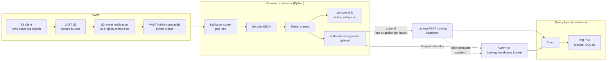

# S3 events into Apache Iceberg on VAST

A walkthrough for running `s3_event_consumer` with its Iceberg sink enabled
against **real VAST infrastructure**: objects land in a VAST S3 bucket, VAST
publishes the notifications through its Kafka-compatible Event Broker, and the
consumer writes them into an Apache Iceberg table whose data files live in a
VAST S3 bucket.

A VAST cluster is required. The only containers involved are the Iceberg
catalog and the query layer — VAST provides the object store and the broker,
and neither is a container here.

- [What this demonstrates](#what-this-demonstrates)
- [Architecture](#architecture)
- [Components](#components)
- [Preparing VAST](#preparing-vast)
- [Configuration](#configuration)
- [Startup sequence](#startup-sequence)
- [Demo script](#demo-script)
- [The table](#the-table)
- [Delivery semantics](#delivery-semantics)
- [Validation status](#validation-status)
- [Troubleshooting](#troubleshooting)
- [Resetting between runs](#resetting-between-runs)
- [What is implemented, and what is not](#what-is-implemented-and-what-is-not)

## What this demonstrates

An object landing in a VAST S3 bucket becomes a Kafka event on the VAST Event
Broker, and that event becomes a queryable row in an Apache Iceberg table whose
data files live in VAST S3. You watch the row count climb while the consumer
runs, then query the table from SQL and from a browser UI, and use
Iceberg-native features — snapshots and time travel — on the result.

**Currently this stores the S3 event *metadata*.** It does not fetch and parse
the referenced object's contents; see [What is implemented, and what is
not](#what-is-implemented-and-what-is-not).

## Architecture



The consumer writes to Iceberg. Trino only reads. Trino is **never** a
dependency of the Python application — it is a container in this demo
environment, nothing more.

Note that the warehouse bucket and the source bucket are **different buckets**.
Writing the warehouse into the watched bucket would make the demo generate
events about its own writes, without end. `scripts/demo_preflight.sh` refuses to
pass if they are the same.

## Components

### Provided by VAST

| Component | Role |
| --- | --- |
| VAST S3 source bucket | The bucket the demo writes objects into. It carries the S3 event notification that feeds the topic. |
| VAST S3 warehouse bucket | The Iceberg **warehouse** — where Parquet data files and Iceberg metadata actually live. |
| VAST Kafka-compatible Event Broker | Publishes the S3 event notifications as Kafka messages. This is the topic the consumer subscribes to. |

### Containers

`docker/docker-compose.yml` starts three services plus a one-shot initialiser.
Every VAST-specific value comes from the environment; nothing is hardcoded.

| Container | Image | Port | Role |
| --- | --- | --- | --- |
| `iceberg-rest` | `apache/iceberg-rest-fixture:1.10.1` | 8181 | Iceberg **REST catalog**. Tracks which metadata file is the current version of each table. Its pointer database is SQLite on a named volume; the table metadata and data files themselves live in VAST S3. |
| `catalog-init` | `busybox:1.36` | — | One-shot. Makes the catalog volume writable by the REST catalog's unprivileged user, then exits. |
| `trino` | `trinodb/trino:435` | 8080 | SQL query engine. Reads the same catalog and the same VAST S3 warehouse the consumer writes to. |
| `sqlpad` | `sqlpad/sqlpad:7.5.7` | 3000 | Browser SQL UI, pre-wired to Trino. The customer-facing view. |

Everything binds to `127.0.0.1` by default (`BIND_ADDRESS`). SQLPad runs with
authentication disabled because there is no one to authenticate on a loopback
interface — if you set `BIND_ADDRESS` to a routable address so a customer can
reach the UI from their own browser, turn authentication back on first.

### Why these choices

**PyIceberg, not Spark.** Spark is the usual Iceberg writer, but it is a JVM
cluster dependency for what is a single-process demo consumer. PyIceberg writes
Iceberg tables directly from Python with no JVM at all. Spark is not a
dependency of this project and is not needed to run any part of this demo.

**A REST catalog, not Hive or a filesystem catalog.** VAST publishes no
Iceberg-specific documentation, and provides no Iceberg catalog service of its
own, so an external REST catalog is the expected approach: VAST supplies the S3
storage, and the catalog is a separate service you run. The REST catalog is also
the portable option — the same consumer configuration works against this
fixture, against a managed catalog, or against anything else speaking the
Iceberg REST protocol, because the client only ever speaks that protocol.

`apache/iceberg-rest-fixture` is a **test fixture**, not a production catalog.
It is the right size for a demo and the wrong thing to build a platform on.

**Trino for queries, and SQLPad for the GUI.** Trino's own web UI at
`http://localhost:8080/ui/` is a cluster and query *monitoring* dashboard — it
has no SQL editor. SQLPad supplies the editor, bundles a native Trino driver so
nothing is downloaded at first use, and is pre-seeded through environment
variables with authentication switched off, so opening it puts you straight into
a query editor against the right catalog.

**Trino's catalog properties are rendered at container start.** Trino reads
catalog properties from files, and those files would otherwise have to contain
the VAST endpoint and access keys. `docker/trino/entrypoint.sh` expands
`docker/trino/iceberg.properties.template` from the environment into the
container's own filesystem before Trino starts, so no VAST value is ever baked
into an image or committed to the repository.

## Preparing VAST

This is cluster-side work, done once, before the demo runs. It is summarised
here; the VAST documentation is authoritative.

**1. An Event Broker.** The Event Broker is a view with the Kafka protocol
enabled. Enabling Kafka on a view automatically enables the S3 Bucket and
Database protocols on it as well. It needs a VIP pool with the `PROTOCOLS` role
and at least one VIP per CNode, and its view policy must use the **S3 Native**
security flavor.
([docs](https://kb.vastdata.com/documentation/docs/configuring-vast-event-broker-1.md))

**2. A topic.** Topics are managed under **DataBase → VAST Database →
*&lt;database named after the Kafka view&gt;* → Kafka-Compatible Broker Topics →
Add Topic**. Default retention is 7 days, and the partition count is fixed at
creation time.
([docs](https://kb.vastdata.com/documentation/docs/managing-event-topics-1.md))

Create the topic explicitly. VAST does **not** support automatic topic creation,
so a consumer pointed at a topic that does not exist will not cause one to
appear.

**3. A bucket notification on the source view.** **Element Store → Views → edit
the view → Bucket Notifications** tab, or from the CLI:

```
eventnotification create --name <NAME> --view-id <ID> --broker-id <ID> \
  --topic <TOPIC> --triggers <TRIGGER> [...]
```

([docs](https://kb.vastdata.com/documentation/docs/configuring-s3-bucket-notifications-for-a-view-1.md))

Trigger keywords include `S3_OBJECT_CREATED_PUT`, `S3_OBJECT_CREATED_POST`,
`S3_OBJECT_CREATED_COPY`, `S3_OBJECT_CREATED_COMPLETE_MULTIPART_UPLOAD`,
`S3_OBJECT_CREATED_ALL`, `S3_OBJECT_REMOVED_DELETE`, `S3_OBJECT_REMOVED_ALL`,
and tagging variants.
([docs](https://kb.vastdata.com/documentation/docs/eventnotification-create.md))
`S3_OBJECT_CREATED_ALL` is the straightforward choice for this demo.

**4. S3 access keys.** Generated per user through VMS. There is no other way to
create them.

### The connectivity test event

Saving a bucket notification makes VAST immediately publish a test event to
prove the wiring works:

```json
{"Service": "Vast S3", "Event": "s3:TestEvent", "Time": "...",
 "Bucket": "...", "RequestId": "...", "HostId": "..."}
```

This is deliberately **not** the `Records` envelope of a real object event.
Left alone it would flatten into a row with every S3 column null, which looks
like a fault during a demo, so `s3events/flatten.py` recognises it and maps it
onto the normal columns. The first row in a fresh table is then
self-explanatory rather than alarming.

### Kafka behaviour worth knowing before you demo

The Event Broker speaks the Kafka protocol, but it is not Kafka, and the
differences are documented
([docs](https://kb.vastdata.com/documentation/docs/kafka-protocol-support.md)):

| Limit | Consequence here |
| --- | --- |
| No automatic topic creation | Create the topic first, by hand or with `scripts/demo_recreate_topic.py`. |
| No over-the-wire compression | Do not set `compression.type` on the client. |
| No transactions | Exactly-once via Kafka transactions is not available. |
| No cooperative rebalancing | Rebalances are eager. |
| No seek-by-time | Replay is by offset or by consumer group, not by timestamp. |
| Max 256 consumer groups per broker view | Do not generate a fresh group per run indefinitely. |
| Messages capped at 1 MB | Not a constraint for event notifications. |

SASL/PLAIN is supported on both encrypted and unencrypted connections.
Authorization is by VAST identity policies, not Kafka ACLs, and the Kafka user
must be a VAST **local** user — AD and LDAP identities are not supported for
Kafka.

`requirements.txt` pins `confluent-kafka>=2.4,<2.9` because VAST documents
support for the Confluent Kafka Python client **2.4 – 2.8** against the Event
Broker. Newer clients may well work; a customer demo is the wrong place to find
out.

> **The Event Broker's listener port is not documented publicly.** Take both the
> VIP addresses and the port from your own cluster's Event Broker configuration.
> This project makes no assumption about which port your cluster uses, and no
> port should be treated as a default until it is confirmed in the lab.

## Configuration

Two files, and one of them holds no secrets.

### `docker/demo.env`

Copy the example and fill it in:

```bash
cp docker/demo.env.example docker/demo.env
```

`docker/demo.env` is git-ignored. It is the single source of truth for the
containers, the consumer and the scripts alike:

| Variable | Meaning |
| --- | --- |
| `VAST_S3_ENDPOINT` | S3 endpoint URL including scheme and, if non-standard, port. Normally `https://`. |
| `VAST_S3_ACCESS_KEY` / `VAST_S3_SECRET_KEY` | Access key pair for a VAST user that can read and write both buckets. |
| `VAST_S3_REGION` | Any string, but it **must** be set — SigV4 signing requires one. VAST's own examples use `us-east-1`. It only has to be consistent across the consumer, the catalog and Trino. |
| `VAST_SOURCE_BUCKET` | The bucket objects are written into, with the notification attached. |
| `VAST_KAFKA_BROKER` | `host:port` list of Event Broker VIPs. |
| `VAST_KAFKA_TOPIC` | The topic the notification publishes into, exactly as named in VAST. |
| `VAST_KAFKA_DATABASE` | VAST Database named after the Kafka-enabled view. Required by `scripts/demo_recreate_topic.py`, not by the consumer. |
| `VAST_KAFKA_GROUP` | Consumer group. Kafka tracks the read position per group. |
| `VAST_VMS_ADDRESS` / `VAST_VMS_USER` / `VAST_VMS_PASSWORD` | VMS credentials for `vastpy`. Token variants and `VMS_*` names also work. |
| `ICEBERG_WAREHOUSE` | `s3://<bucket>/` for the warehouse. Must not be `VAST_SOURCE_BUCKET`. |
| `ICEBERG_CATALOG_URI` | Where containers reach the catalog (`http://iceberg-rest:8181`). |
| `ICEBERG_CATALOG_URI_HOST` | Where the consumer and scripts reach it from the host (`http://localhost:8181`). |
| `ICEBERG_NAMESPACE` / `ICEBERG_TABLE` | The table the consumer creates and Trino queries. |
| `BIND_ADDRESS` | Interface the containers publish on. `127.0.0.1` by default. |

Source it into your shell before doing anything else:

```bash
set -a; . ./docker/demo.env; set +a
```

### `s3_consumer_config.json`

```bash
cp s3_consumer_config.vast-demo.example.json s3_consumer_config.json
```

Every value in it is an `env:NAME` reference, so the file itself contains no
endpoint, no bucket name and no credential:

```json
{
  "kafka_config": {
    "bootstrap.servers": "env:VAST_KAFKA_BROKER",
    "group.id": "env:VAST_KAFKA_GROUP",
    "auto.offset.reset": "earliest"
  },
  "topic": "env:VAST_KAFKA_TOPIC",
  "iceberg": {
    "enabled": true,
    "namespace": "env:ICEBERG_NAMESPACE",
    "table": "env:ICEBERG_TABLE",
    "batch_size": 25,
    "flush_interval_seconds": 5,
    "create_if_missing": true,
    "max_flush_attempts": 5,
    "retry_backoff_seconds": 5,
    "catalog": {
      "type": "rest",
      "uri": "env:ICEBERG_CATALOG_URI_HOST",
      "warehouse": "env:ICEBERG_WAREHOUSE",
      "s3.endpoint": "env:VAST_S3_ENDPOINT",
      "s3.access-key-id": "env:VAST_S3_ACCESS_KEY",
      "s3.secret-access-key": "env:VAST_S3_SECRET_KEY",
      "s3.region": "env:VAST_S3_REGION",
      "s3.force-virtual-addressing": false
    }
  }
}
```

`env:NAME` resolution applies to `kafka_config` string values, `topic`,
`iceberg.namespace`, `iceberg.table`, `iceberg.catalog_name`, and every property
under `iceberg.catalog`. Anything not written that way is used literally.

`batch_size` 25 and `flush_interval_seconds` 5 are demo values, chosen so a
commit is visible within a few seconds of publishing events. In anything
resembling production both should be much larger — every commit is a snapshot.

### Why `s3.force-virtual-addressing` is `false`

VAST S3 addresses buckets **by path**, not by DNS subdomain. Virtual-hosted
style would resolve `bucket.s3.your-vast.example`, which does not exist; it
also cannot be used at all with an IP-address endpoint, and needs wildcard TLS
certificates where it can be used. Path style is the recommended choice for
on-premises VAST.
([docs](https://kb.vastdata.com/docs/path-and-virtual-hosted-style-s3-urls))

The PyIceberg property for this is `s3.force-virtual-addressing`, set to
`false`. There is **no** `s3.path-style-access` property in PyIceberg 0.11.1 —
a config carrying that key is silently ignored, which is the worst kind of
wrong. Trino and the Iceberg REST catalog are different products with different
property names: `s3.path-style-access=true` in
`docker/trino/iceberg.properties.template`, and
`CATALOG_S3_PATH__STYLE__ACCESS=true` for the catalog container, are correct
where they appear.

### Credentials

Credentials live in `docker/demo.env` and reach everything else through the
environment. They are redacted from every log line the consumer writes,
including any embedded in a catalog URI, and `scripts/demo_preflight.sh` masks
them in its output. They are still in your shell environment and possibly your
shell history, so treat them accordingly.

## Startup sequence

Order matters, and the compose file enforces it with health checks and
`depends_on` conditions, so `docker compose up` is enough:

1. **`catalog-init`** chowns the catalog volume and exits 0.
2. **`iceberg-rest`** starts and reports healthy. It reads and writes table
   metadata directly in VAST S3, so it needs the warehouse bucket to exist and
   the credentials to work.
3. **`trino`** starts once the catalog is healthy; its entrypoint renders the
   catalog properties from the environment, then loads the `iceberg` catalog.
4. **`sqlpad`** starts once Trino is healthy.

VAST S3 and the Event Broker are already running — they are not part of this
sequence. Then, separately, **the consumer** creates the namespace and table on
first run if they do not exist.

## Demo script

### 0. Install

```bash
python3 -m venv .venv
source .venv/bin/activate
pip install -r requirements.txt -r requirements-iceberg.txt
```

The Iceberg extra is a large install (PyArrow and friends, roughly 250 MB). See
the packaging note in the [README](../README.md#packaging-and-the-standalone-executables).

`pip install boto3` as well if you want the preflight's authenticated VAST S3
checks, which are much stronger than the unauthenticated ones.

### 1. Point everything at your cluster

```bash
cp docker/demo.env.example docker/demo.env
# edit docker/demo.env with your VAST values, then:
set -a; . ./docker/demo.env; set +a
cp s3_consumer_config.vast-demo.example.json s3_consumer_config.json
```

### 2. Start the supporting containers

```bash
docker compose -f docker/docker-compose.yml up -d --wait
```

`--wait` blocks until every health check passes. First run pulls several GB of
images. If `iceberg-rest` never becomes healthy, it is almost always the VAST S3
credentials or the warehouse bucket — see [Troubleshooting](#troubleshooting).

### 3. Run the preflight

```bash
./scripts/demo_preflight.sh
```

Twenty-three checks across eight layers: the environment, the Python
environment, the consumer configuration, VAST S3 reachability and
authentication, the Event Broker, the containers, the catalog/Trino/SQLPad, and
the Iceberg table. It prints one line per check and exits non-zero if anything
that would break the demo is wrong. Credentials are masked; endpoints and bucket
names are printed, because you need to see what you are pointed at.

It is read-only with one deliberate exception, clearly marked: the last check
creates the namespace and table if they do not exist. Skip that with
`--no-table-init`.

Run this **before the customer arrives**, not in front of them.

### 4. Create the table, and show the row count is zero

```bash
python3 s3_event_consumer.py --config s3_consumer_config.json --check
```

`--check` validates the configuration, connects to the catalog, creates the
namespace and table if they are missing, then exits without consuming. It is the
fastest way to prove the whole write path works before involving Kafka at all.

```bash
docker compose -f docker/docker-compose.yml exec -T trino \
  trino --execute "SELECT count(*) FROM iceberg.s3_events.object_events"
```

```
"0"
```

(Substitute your own `ICEBERG_NAMESPACE` and `ICEBERG_TABLE` if you changed them
from the defaults in `docker/demo.env.example`.)

### 5. Start the consumer

In its own terminal, so you can watch events arrive:

```bash
python3 s3_event_consumer.py --config s3_consumer_config.json
```

```
2026-08-31 12:29:14 INFO    Configuration:      s3_consumer_config.json
2026-08-31 12:29:14 INFO    Bootstrap servers:  vip-1:<KAFKA_PORT>,vip-2:<KAFKA_PORT>
2026-08-31 12:29:14 INFO    Consumer group:     vast-iceberg-demo
2026-08-31 12:29:14 INFO    Topic:              s3-events
2026-08-31 12:29:14 INFO    Iceberg table:      s3_events.object_events
2026-08-31 12:29:14 INFO    Iceberg catalog:    http://localhost:8181
2026-08-31 12:29:14 INFO    Iceberg warehouse:  s3://iceberg-warehouse/
2026-08-31 12:29:14 INFO    Iceberg S3 endpoint: https://s3.vast.example.com
2026-08-31 12:29:14 INFO    Iceberg batching:   up to 25 record(s) or 5.0s, whichever comes first
2026-08-31 12:29:15 INFO    Using existing Iceberg table s3_events.object_events at s3://iceberg-warehouse/s3_events/object_events
2026-08-31 12:29:15 INFO    Subscribed to 's3-events'. Waiting for events (Ctrl-C to stop).
```

The warehouse and S3 endpoint are logged deliberately: pointing a demo at the
wrong cluster is easy, and this makes it obvious in the first four lines.
Credentials embedded in a catalog URI are redacted.

### 6. Write objects into the watched bucket

In a third terminal. This is the actual demonstration — a real object landing in
VAST:

```bash
echo "sensor,reading
a,41.2" > /tmp/readings.csv

aws s3api put-object \
  --endpoint-url "$VAST_S3_ENDPOINT" \
  --bucket "$VAST_SOURCE_BUCKET" \
  --key demo/readings.csv \
  --body /tmp/readings.csv
```

Use the `demo/` key prefix: that is the only prefix `scripts/demo_reset.sh
--purge-source` will ever delete from.

The consumer's terminal prints the payload VAST published. Real VAST events use
`eventName: "s3:ObjectCreated:Put"` — **with** the `s3:` prefix — and
`eventSource: "vast:s3"`.
([docs](https://kb.vastdata.com/documentation/docs/s3-event-record-format.md))

For a larger burst without writing hundreds of objects, synthetic events can be
published straight onto the topic:

```bash
python3 scripts/publish_test_events.py \
  --bootstrap-servers "$VAST_KAFKA_BROKER" \
  --topic "$VAST_KAFKA_TOPIC" \
  --count 40
```

These are modelled on the VAST payload shape, including the `s3:` prefix and
`vast:s3` source. By default one message in five uses a deliberately awkward
payload — missing `size`, missing `eTag`, an unparseable `eventTime`, two
records in one message, a URL-encoded key, an empty `Records` list, or a payload
that is not an S3 event at all. That is the point: the flattening code has to
cope. Pass `--well-formed-only` for a tidier demo.

They are **test rows** in the customer's table. Run `./scripts/demo_reset.sh
--confirm` afterwards to get back to a clean baseline.

The consumer reports each commit:

```
2026-08-31 12:29:19 INFO    Committed 25 record(s) to s3_events.object_events (batch size reached); 25 record(s) total in this session.
2026-08-31 12:29:24 INFO    Committed 15 record(s) to s3_events.object_events (flush interval elapsed); 40 record(s) total in this session.
```

Note **two commits for forty events**. One Iceberg snapshot per Kafka event
would be a poor design — thousands of one-row Parquet files and an unreadable
snapshot history — so records buffer until either `batch_size` (25 here) or
`flush_interval_seconds` (5) is reached.

### 7. Watch the pipeline move

The interesting picture is not one counter. It is four, in order, because they
do not advance together: objects land in the watched bucket, VAST publishes
Kafka events, the consumer writes Iceberg rows, and a Parquet file appears only
when Iceberg commits a snapshot (a batch of 25 or 5s in this config).

In its own terminal:

```bash
python3 scripts/demo_watch.py
```

That is a full-screen view, redrawn every 5 seconds. The three event meters
share a scale so you can see Iceberg trailing S3; Parquet is one block per
file, so each commit is a visible tick. Sparklines on the right are *rates*,
not totals, which is why they jump on a burst of PUTs and stay quiet between
Iceberg flushes.

Drive it with real objects in a third terminal:

```bash
python3 scripts/demo_ingest.py --count 200 --interval 0.15
```

Keys land under `demo/`, the prefix `scripts/demo_reset.sh --purge-source`
will delete. `--plain` is a vmstat-style line instead of the full screen;
`--synthetic` animates the same layout without a cluster, which is the way to
rehearse the screen before the customer arrives.

The Trino `watch` one-liner still works if you only care about the row count:

```bash
watch -n 2 'docker compose -f docker/docker-compose.yml exec -T trino \
  trino --execute "SELECT count(*) FROM iceberg.s3_events.object_events"'
```

### 8. Query the latest rows in the GUI

Open **<http://localhost:3000>**. No login, and the `VAST S3 - Apache Iceberg`
connection is already selected with the `s3_events` schema browsable in the
sidebar.

```sql
SELECT ingest_time, event_name, bucket, object_key, object_size
FROM s3_events.object_events
ORDER BY ingest_time DESC, kafka_offset DESC
LIMIT 20;
```

Prefer a terminal? The Trino CLI is inside the container:

```bash
docker compose -f docker/docker-compose.yml exec trino trino
```

```sql
USE iceberg.s3_events;
SELECT count(*) FROM object_events;
```

### 9. Demonstrate Iceberg-native capabilities

**Snapshots.** Every commit is a snapshot, and Iceberg keeps the lineage:

```sql
SELECT snapshot_id, committed_at, operation, summary['added-records'] AS added
FROM iceberg.s3_events."object_events$snapshots"
ORDER BY committed_at;
```

```
     snapshot_id     |        committed_at         | operation | added
---------------------+-----------------------------+-----------+-------
 4969459501675822066 | 2026-08-31 17:29:19.203 UTC | append    | 25
 1756592349298766766 | 2026-08-31 17:29:24.375 UTC | append    | 15
```

**Time travel.** Query the table as it was at an earlier snapshot — the older
data files were never rewritten, so the old view is still exact:

```sql
SELECT count(*) FROM iceberg.s3_events.object_events
FOR VERSION AS OF 4969459501675822066;
```

```
 25
```

...against `SELECT count(*)` on the live table returning `40`. By wall-clock
time instead of snapshot id:

```sql
SELECT count(*) FROM iceberg.s3_events.object_events
FOR TIMESTAMP AS OF TIMESTAMP '2026-08-31 17:29:20 UTC';
```

**Hidden partitioning and file layout.** The table is partitioned by ingestion
day, but no query ever mentions the partition column — Iceberg derives it:

```sql
SELECT file_path, record_count FROM iceberg.s3_events."object_events$files";
```

```
 s3://iceberg-warehouse/s3_events/object_events/data/ingest_time_day=2026-08-31/00000-0-7de0a03d-....parquet |  25
 s3://iceberg-warehouse/s3_events/object_events/data/ingest_time_day=2026-08-31/00000-0-c3aab186-....parquet |  15
```

**The files themselves**, in VAST S3:

```bash
aws s3 ls --recursive \
  --endpoint-url "$VAST_S3_ENDPOINT" \
  "${ICEBERG_WAREHOUSE}"
```

```
s3_events/object_events/data/ingest_time_day=2026-08-31/00000-0-7de0a03d-....parquet   10KiB
s3_events/object_events/data/ingest_time_day=2026-08-31/00000-0-c3aab186-....parquet  9.4KiB
s3_events/object_events/metadata/00000-c66d76fd-....metadata.json                     1.8KiB
s3_events/object_events/metadata/00001-d3d7d798-....metadata.json                     2.6KiB
s3_events/object_events/metadata/00002-d3cc29a2-....metadata.json                     3.4KiB
s3_events/object_events/metadata/7de0a03d-...-m0.avro                                 5.7KiB
s3_events/object_events/metadata/c3aab186-...-m0.avro                                 5.7KiB
s3_events/object_events/metadata/snap-1756592349298766766-0-....avro                  1.8KiB
s3_events/object_events/metadata/snap-4969459501675822066-0-....avro                  1.7KiB
```

That is the whole Iceberg model visible at once, sitting in the customer's own
object store: Parquet **data files** under a hidden partition directory; one
**metadata.json** per table version; **manifest** files (`-m0.avro`) listing data
files; and **manifest lists** (`snap-<id>-...avro`), one per snapshot.

The AWS CLI is not a dependency of this project — any S3 browser pointed at the
same endpoint shows the same thing.

### 10. Stop

Ctrl-C the consumer. It flushes whatever is still buffered before exiting, so a
graceful shutdown does not leave buffered records unwritten:

```
2026-08-31 12:41:06 INFO    Interrupted, shutting down.
2026-08-31 12:41:06 INFO    Flushing 10 buffered record(s) before shutdown.
2026-08-31 12:41:06 INFO    Committed 10 record(s) to s3_events.object_events (shutdown); 35 record(s) total in this session.
2026-08-31 12:41:06 INFO    Iceberg sink closed: 35 record(s) written in 2 commit(s), 0 still unwritten.
2026-08-31 12:41:06 INFO    Closing Kafka consumer.
```

Then stop the containers:

```bash
docker compose -f docker/docker-compose.yml down
```

**Do not reach for `-v` out of habit.** The warehouse is in VAST S3 and is not
touched by either command, but `-v` deletes the catalog's SQLite volume — which
holds the pointers to the current metadata file for each table. Dropping it
leaves the table's data and metadata sitting in the bucket with nothing that
knows the table exists. Use `scripts/demo_reset.sh` to clear the demo out
properly.

### Running it all at once

`scripts/smoke_test.sh` drives the whole path unattended and asserts the results
— row count grew by exactly the number of events published, new snapshots were
created, batching actually batched, the Parquet and metadata files exist in the
warehouse bucket, and `--no-iceberg` still runs console-only:

```bash
set -a; . ./docker/demo.env; set +a
./scripts/smoke_test.sh
```

It publishes **synthetic** events onto the configured topic, so it leaves test
rows behind; run `./scripts/demo_reset.sh --confirm` afterwards. Pass `--down`
to stop the containers when it finishes.

It needs Docker, a reachable broker and the Iceberg extra. It is deliberately
**not** part of `python3 -m unittest discover -s tests`, which never needs
Docker, a broker, object storage or a live catalog.

## The table

`s3_events.object_events`, schema declared explicitly in
[`s3events/sinks/iceberg.py`](../s3events/sinks/iceberg.py):

| Column | Iceberg type | Required | Notes |
| --- | --- | --- | --- |
| `ingest_time` | `timestamptz` | yes | When the consumer received the message. The partition source. |
| `kafka_topic` | `string` | no | |
| `kafka_partition` | `int` | no | |
| `kafka_offset` | `long` | no | |
| `record_index` | `int` | no | Position within the message's `Records` array. |
| `event_name` | `string` | no | From VAST, `s3:ObjectCreated:Put` and similar. |
| `event_time` | `timestamptz` | no | Reported by S3, when the payload carries one. |
| `event_source` | `string` | no | `vast:s3` for VAST-generated events. |
| `bucket` | `string` | no | |
| `object_key` | `string` | no | URL-decoded. |
| `object_size` | `long` | no | Bytes, when present. |
| `object_etag` | `string` | no | |
| `raw_event` | `string` | yes | The Kafka message payload verbatim. |

Partitioned by `day(ingest_time)`.

**Why the schema is explicit.** Inferring it from whatever event arrived first
would produce a table whose shape depends on a sample — and VAST payload schemas
vary by release. Everything except `ingest_time` and `raw_event` is optional,
because no field of an S3 event notification is guaranteed to be there.

**Why `raw_event` exists.** Flattening is lossy by construction. Keeping the
original payload as a string means nothing dropped by the flattener is
unrecoverable, and you can always reach fields the schema has no column for:

```sql
SELECT json_extract_scalar(raw_event, '$.Records[0].awsRegion') AS region,
       count(*)
FROM iceberg.s3_events.object_events
GROUP BY 1;
```

**One Kafka message can produce several rows.** An S3 notification carries a
`Records` array; each element becomes a row, sharing the message's Kafka offset,
ingestion timestamp and `raw_event`, distinguished by `record_index`.

**Adopting an existing table.** If the table already exists, the sink uses it
rather than failing — but it compares the table's columns with the ones it
writes and logs a warning if they differ. A table left over from an older
version of this project, or created by something else entirely under the same
name, is then visible in the logs instead of producing confusing nulls.

## Delivery semantics

The contract, when the Iceberg sink is enabled:

> **Nothing is acknowledged to Kafka that is not already durable in Iceberg.**

Concretely, per batch:

1. Records are buffered, together with the Kafka offset each came from.
2. The batch is appended to Iceberg. This is one commit, one snapshot.
3. **Only if that append succeeded**, the Kafka offsets are committed —
   synchronously, as `last offset + 1` per partition.

`enable.auto.commit` is forced off when the Iceberg sink is on, because
librdkafka's automatic commits advance the read position on a timer with no
relation to whether the records reached the table. With the sink off, offset
handling is untouched and behaves exactly as it always did.

### What happens when Iceberg is unavailable

A failed append **keeps its batch**. The records and their offsets stay
buffered, and the append is retried with exponential backoff
(`retry_backoff_seconds`, doubling, capped at 60s) so an outage never becomes a
hot loop against a dead endpoint. Each attempt is logged.

The retry is bounded two ways:

| Bound | Default | On reaching it |
| --- | --- | --- |
| `max_flush_attempts` | 5 consecutive failures | Consumer stops, exit 1 |
| `max_buffered_records` | 10 × `batch_size` | Consumer stops, exit 1 |

Either way the records are **still buffered and their offsets still
uncommitted**, so stopping is what preserves them: they remain on the Kafka
topic and are reprocessed when the consumer is restarted against a healthy
catalog.

Note the retention window this depends on. VAST topics default to **7 days**;
records only survive an outage for as long as the topic retains them.

On Ctrl-C, the sink flushes to Iceberg first and commits offsets only if that
succeeded. If the final flush fails, the consumer exits **non-zero** having
committed nothing.

`scripts/outage_test.sh` exercises all of this against the configured stack — it
stops the REST catalog mid-run, publishes events into the outage, asserts the
consumer exits non-zero with no offsets committed and no rows written, then
restores the catalog and asserts every event is subsequently ingested.

```bash
./scripts/outage_test.sh
```

### At-least-once, and what that costs

This is **at-least-once delivery, not exactly-once.** Under the tested
single-consumer architecture, Iceberg write failures do not advance Kafka
offsets, and the outage/recovery tests demonstrate successful replay without
data loss. There is one window in which records can be **duplicated**: between a
successful Iceberg commit and its Kafka offset commit. If the process is killed
there, the next run replays those records and appends them again.

Kafka transactions are not an escape route: the VAST Event Broker does not
support them.

What that claim covers, and what it does not, is set out in
[Validation status](#validation-status). Kafka rebalance behaviour and the real
VAST lab environment have not yet been validated.

There is **no deduplication**. Anything that replays a topic — a hard kill, a
consumer-group offset reset, deliberately re-reading with
`auto.offset.reset: earliest` under a fresh group — appends the events again.

Every row carries the Kafka coordinates it came from, so duplicates are at least
identifiable:

```sql
SELECT kafka_topic, kafka_partition, kafka_offset, record_index, count(*) AS copies
FROM iceberg.s3_events.object_events
GROUP BY 1, 2, 3, 4
HAVING count(*) > 1
ORDER BY copies DESC;
```

Making that impossible needs idempotency — an Iceberg MERGE keyed on
`(topic, partition, offset, record_index)`, or a dedup pass at query time. That
is future work, not implemented here.

## Validation status

Everything here has been exercised end to end against a **local stand-in stack**
driven entirely by environment variables, using the exact compose file that
ships in this repository. It has **not** yet been run against a real VAST
cluster. Both statements matter when reading any claim in this document.

### STAND-IN VALIDATION — COMPLETE

Using `docker/docker-compose.yml` as shipped, with the VAST endpoints and
credentials supplied through the same environment variables a real cluster would
populate:

- 278 unit tests pass
- `ruff` clean
- `shellcheck` clean on every script
- full smoke test: 40 events published, 40 rows written, 2 snapshots created,
  Parquet files, manifests and an `ingest_time_day=` partition directory present
  in the warehouse
- outage/recovery test: catalog stopped mid-run — consumer exits 1, no Kafka
  offsets committed, no rows written; catalog restored — all 30 events replayed
  and ingested, offset advanced to 30
- preflight: 23 of 23 checks pass
- reset verified, including its guard rails
- PyInstaller build

### VAST LAB VALIDATION — PENDING

None of the following has been performed. The VAST lab is reachable only from
the maintainer's work environment, and these tests will be run there separately.
Nothing in this repository simulates or stands in for them:

- a real VAST Kafka-compatible Event Broker, including its listener port
- real VAST-generated S3 event payloads
- the VAST connectivity test event as actually published
- VAST S3 as the Iceberg warehouse
- VAST S3 endpoint, TLS and authentication behaviour
- the Iceberg REST catalog writing metadata into VAST S3
- REST catalog connectivity from the work lab
- end-to-end VAST S3 PUT → Event Broker → consumer → Iceberg → query
- multi-event/batch behaviour using the real Event Broker
- failure/recovery behaviour in the VAST environment
- `confluent-kafka` 2.4–2.8 against the real broker

### Known gaps in the stand-in validation

- **Kafka rebalance behaviour.** Every test runs a single consumer against a
  single-partition topic. What happens to buffered-but-unwritten records when a
  partition is reassigned mid-batch has not been exercised. VAST does not
  support cooperative rebalancing, so any rebalance is eager.
- **The synthetic event payloads** in `scripts/publish_test_events.py` are
  modelled on VAST's documented record format, not captured from a live cluster.
  The flattening code is deliberately defensive about this, but the real payload
  schema is a VAST-side detail that only the lab can confirm.

## Troubleshooting

Organised by layer, outermost first.

### `Cannot start: PyIceberg is not installed`

The Iceberg extra is not installed, or you are running a prebuilt standalone
executable — which deliberately does not bundle it.

```bash
pip install -r requirements-iceberg.txt
```

### A config value is a literal `env:SOMETHING` in the logs

The variable is not set in the consumer's environment. `env:NAME` is resolved at
startup from the environment, so it has to be exported into the shell that runs
the consumer:

```bash
set -a; . ./docker/demo.env; set +a
```

`docker compose` reads the same variables from the same shell, so a container
that started with the wrong values almost always means this was skipped.

### VAST S3: `Could not access bucket` in the preflight

```bash
./scripts/demo_preflight.sh --no-table-init
```

Work down its output. In order of likelihood: the key pair is wrong or was
generated for a different user; the user lacks permission on that bucket; the
bucket name is wrong; the endpoint is right but the region string is missing —
SigV4 requires one even where VAST does not route on it.

If the endpoint itself is unreachable (`HTTP 000`), it is DNS, routing or TLS,
not credentials:

```bash
curl -v --max-time 10 "$VAST_S3_ENDPOINT"
```

An endpoint answering `403 AccessDenied` to an unauthenticated request is
healthy — it proves TLS, DNS and routing all work.

### VAST S3: signature or addressing errors

If PyIceberg reports a signature mismatch or a host that does not resolve, check
that `s3.force-virtual-addressing` is `false`. A bucket name appearing in the
*hostname* of a failed request is the signature of virtual-hosted addressing
being used against a VAST endpoint that cannot serve it.

### Event Broker: no messages arrive

The consumer is idle and silent, which is also what a healthy idle consumer
looks like. In order:

1. Confirm the topic name matches VAST exactly. Automatic topic creation is not
   supported, so a typo means subscribing to a topic that does not exist rather
   than one being created.
2. Confirm the bucket notification is attached to the right view and targets the
   right topic and broker.
3. Save the notification again — VAST publishes a connectivity test event when
   you do, which is a direct end-to-end proof of the wiring. The consumer
   recognises it and writes it as a row.
4. Confirm the consumer group has not already consumed past the events. A group
   that has read to the end sees nothing on restart; use
   `./scripts/demo_reset.sh --confirm` to clear its offsets.
5. Confirm the port. It is not documented publicly and must come from your
   cluster's Event Broker configuration.

### Event Broker: authentication failures

Kafka authorization is by VAST identity policies, not Kafka ACLs, and the Kafka
user must be a VAST **local** user — an AD or LDAP identity will not work. If
your broker requires SASL or TLS, add `security.protocol`, `sasl.*` and `ssl.*`
under `kafka_config`; they are passed straight through to librdkafka.

Do not set `compression.type`: the Event Broker does not support
over-the-wire compression.

### `iceberg-rest` never becomes healthy

The catalog talks to VAST S3 itself, so its failures are usually VAST S3
failures:

```bash
docker compose -f docker/docker-compose.yml ps
docker compose -f docker/docker-compose.yml logs iceberg-rest
curl -s "http://localhost:8181/v1/config?warehouse=$ICEBERG_WAREHOUSE"
```

Check that `ICEBERG_WAREHOUSE`, `VAST_S3_ENDPOINT` and the key pair were all
exported before `docker compose up` ran.

### `iceberg-rest` exits immediately with `SQLITE_CANTOPEN`

The catalog volume is not writable by the container's unprivileged user. This is
what `catalog-init` prevents. If you added the volume by hand, or removed
`catalog-init`, recreate the stack:

```bash
docker compose -f docker/docker-compose.yml down -v
docker compose -f docker/docker-compose.yml up -d --wait
```

`-v` here deletes the catalog pointer database, so any existing table becomes
invisible even though its files remain in the warehouse bucket.

### The consumer runs, prints events, but the table stays empty

Look for `Committed ... record(s)` in the consumer's stderr.

- If the startup banner has no `Iceberg table:` / `Iceberg warehouse:` lines at
  all, the sink is not on: the `iceberg` section is missing or `enabled` is
  false. `Iceberg sink disabled by --no-iceberg.` means the flag is on the
  command line.
- If you see nothing, the batch is still filling. With the demo config, a
  partial batch is written within 5 seconds; the default config waits 10.
- If you see `Iceberg append failed`, the message says why. The consumer keeps
  running by design, so this does not stop the console output.

### The consumer exits 1 saying records could not be written

Iceberg was unavailable and the bounded retry ran out. This is working as
designed: the records are still on the Kafka topic and their offsets were never
committed. Fix the catalog, restart the consumer, and they will be reprocessed —
provided the topic still retains them.

```bash
docker compose -f docker/docker-compose.yml ps iceberg-rest
docker compose -f docker/docker-compose.yml logs --tail 50 iceberg-rest
```

To ride out longer outages, raise `max_flush_attempts` and
`max_buffered_records` — but memory is the real limit, and stopping is safe.

### The sink warns that the existing table's columns differ

The table already existed and its schema is not the one this sink writes. Either
it was created by an older version of this project, or something else owns that
name. Point `ICEBERG_TABLE` somewhere else, or drop and recreate it with
`./scripts/demo_reset.sh --confirm`.

### Trino says `Failed to load table` or the schema is missing

Trino caches catalog metadata briefly. If the consumer created the table
seconds ago, retry. If the table genuinely does not exist, run the consumer with
`--check` to create it.

### Queries fail with an S3 access error from Trino

Trino renders its own catalog properties at start-up from the same environment
variables the consumer uses, so a mismatch means the container was started with
a different environment than the consumer is now using. Check what it actually
rendered:

```bash
docker compose -f docker/docker-compose.yml exec trino \
  cat /etc/trino/catalog/iceberg.properties
```

Then recreate it with the environment sourced:

```bash
set -a; . ./docker/demo.env; set +a
docker compose -f docker/docker-compose.yml up -d --force-recreate trino
```

Note that Trino's `s3.path-style-access=true` is correct — it is Trino's own
property name for the same behaviour PyIceberg spells
`s3.force-virtual-addressing=false`.

### The first row has nulls in every S3 column

If `event_name` is `s3:TestEvent` and `event_source` is `Vast S3`, that is the
connectivity test event VAST publishes when a bucket notification is saved, and
it is mapped onto the normal columns rather than left null. Anything else with
all-null S3 columns is a payload the flattener did not recognise — `raw_event`
holds it verbatim, so query that column to see what arrived.

### Row counts differ between the consumer's tally and SQL

The consumer counts *rows written*; one Kafka message can produce several. And
if you replay a topic after resetting offsets, events are written twice — the
sink appends, it does not deduplicate.

## Resetting between runs

`scripts/demo_reset.sh` returns the demo to a known starting condition: the
Iceberg table dropped and recreated empty, and the demo's Kafka consumer group
offsets deleted so the topic replays.

```bash
./scripts/demo_reset.sh              # dry run: prints what it would do, changes nothing
./scripts/demo_reset.sh --confirm    # apply
```

Optionally, it will also remove the demo objects previously written into the
watched bucket, under the `demo/` prefix only:

```bash
./scripts/demo_reset.sh --confirm --purge-source
```

It is deliberately hard to misuse, because it points at a customer's cluster:

- nothing changes without `--confirm`;
- it only ever touches the one `ICEBERG_NAMESPACE`.`ICEBERG_TABLE` named in the
  environment, and refuses obviously dangerous values such as `default`,
  `system`, `information_schema` or `*`;
- it never deletes a bucket;
- object deletion is restricted to the demo key prefix inside
  `VAST_SOURCE_BUCKET`, and every key is listed first;
- `--purge-source` is opt-in on top of `--confirm`.

Resetting the consumer group is the gentlest reset available: it replays the
topic without touching any data. That works only while the events are still
within the topic's retention window (7 days by default).

That replay does **not** empty the Kafka log. `scripts/demo_watch.py` reports
KAFKA EVENTS as retained messages on the topic (high watermark minus low
watermark), so a week of prior demo traffic stays visible until the topic
itself is deleted and created again. VAST does not auto-create topics, so
this has to go through VMS. `scripts/demo_recreate_topic.py` does it with the
official Python SDK (`pip install vastpy`):

```bash
python3 -m pip install vastpy
set -a; . ./docker/demo.env; set +a
python3 scripts/demo_recreate_topic.py              # dry run
python3 scripts/demo_recreate_topic.py --confirm    # apply
```

It copies the existing partition count and retention, then deletes and
recreates the one topic named by `VAST_KAFKA_TOPIC` in
`VAST_KAFKA_DATABASE`. By default it also deletes `VAST_KAFKA_GROUP`, because
committed offsets from the old log would skip the new one. It changes nothing
without `--confirm`, and it does not drop Iceberg or delete S3 objects.

Stop the demo consumer first. After it finishes, re-save the source bucket
notification in VMS so events keep landing on the new topic (saving also
publishes the connectivity test event).

## What is implemented, and what is not

### Implemented

- S3 event **metadata** into an Iceberg table in a VAST S3 bucket.
- Multi-sink dispatch; console output unchanged and still the default.
- Defensive flattening — no field assumed present, one row always produced,
  never raises — including VAST's connectivity test event.
- Buffered writes with configurable size and time bounds; flush on shutdown.
- Automatic namespace and table creation with an explicit schema, and a warning
  when an adopted table's columns differ from the ones written.
- Catalog properties passed straight through to PyIceberg; `env:` references
  throughout the configuration; secrets redacted from logs, including
  credentials embedded in a catalog URI.
- Startup failures fatal; runtime write failures retried with bounded backoff,
  never dropped.
- Kafka offsets committed only after the corresponding Iceberg commit, so an
  Iceberg outage does not advance the read position past unwritten records.
- Preflight and reset scripts sized for running this in front of a customer.

### Not implemented

**Object-content ingestion — the next logical milestone.** Today a row records
*that* `s3://demo-data/readings.csv` was written, and its size and ETag. It says
nothing about what is *in* the file. The next step:

```
S3 event
  -> extract bucket + key
  -> GET the object from VAST S3
  -> parse its contents (CSV, JSON, Parquet, ...)
  -> write the object's records into a second Iceberg table
```

That is a materially larger piece of work than what is here, and deliberately
out of scope for this milestone. It needs at least: an S3 client and credentials
for reading the *data* buckets (separate from the warehouse credentials); a
content-type/format detection and parsing strategy; a per-format target schema,
or an evolving one; size limits and streaming for large objects; a policy for
unparseable or partially-parseable objects; back-pressure, because fetching and
parsing is far slower than consuming Kafka messages, so the current
flush-on-the-poll-thread design would need to change; and idempotency, so a
replayed event does not duplicate an object's rows.

The sink architecture is what makes it tractable: it lands as an additional
sink, not as changes to the event path or the console output.

**Other known gaps.**

- *At-least-once, not exactly-once.* See
  [Delivery semantics](#delivery-semantics) — a failure between an Iceberg
  commit and its offset commit duplicates those records.
- *No deduplication.* A replay appends the events again. The Kafka coordinates
  on every row make duplicates identifiable after the fact, but nothing prevents
  them.
- *Flushing blocks the poll loop.* Correct and simple for a demo; a slow catalog
  would stall consumption. A background writer thread is the fix if throughput
  ever matters.
- *No schema evolution.* The table is created once. Changing the schema in code
  will not migrate an existing table.
- *No compaction or snapshot expiry.* A long-running demo accumulates small
  files. `ALTER TABLE ... EXECUTE optimize` in Trino is the manual remedy.
- *The catalog is a test fixture.* `apache/iceberg-rest-fixture` is fine for a
  demo and is not a production catalog service.
